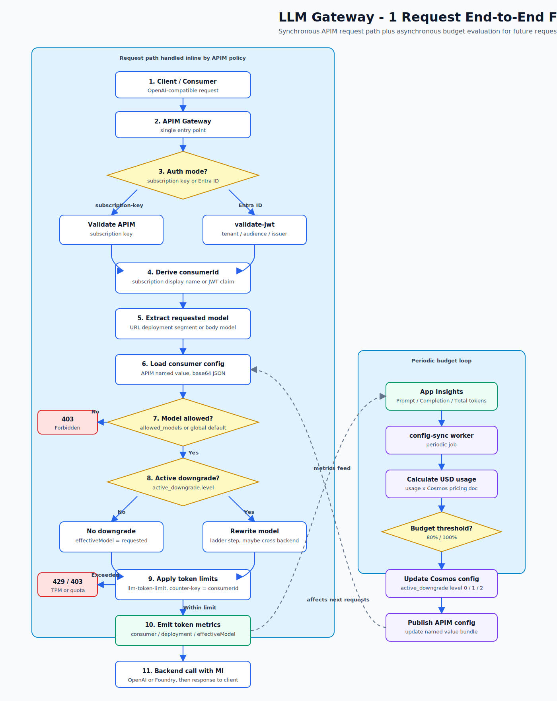

# 개요

## 1. Overview

Azure AI Gateway는 [Azure API Management](https://learn.microsoft.com/ko-kr/azure/api-management/api-management-key-concepts) 위에 구축된 **엔터프라이즈 AI 거버넌스 엔드포인트**입니다. 다수의 LLM 백엔드를 단일 진입점 뒤에 숨기고, 소비자별 권한·속도 제한·예산 제어를 중앙에서 일괄 적용합니다.

### 문제 정의

기업 내 여러 팀이 각자 Azure OpenAI나 Microsoft Foundry 모델을 직접 호출하면 다음 문제가 생깁니다.

* **키 관리 분산** — 팀마다 API 키를 별도로 발급·보관하면 키 유출·키 회전이 어렵습니다.
* **비용 통제 불가** — 어느 팀이 얼마나 쓰는지 집계할 중심 지점이 없습니다.
* **모델 거버넌스 없음** — 특정 팀에 특정 모델만 허용하거나 사용량을 제한할 방법이 없습니다.
* **백엔드 교체 영향** — 모델 배포가 바뀌면 모든 클라이언트 설정을 함께 변경해야 합니다.

Azure AI Gateway는 이 모든 문제를 **단일 거버넌스 레이어** 하나로 해결합니다.

### 기능 구성요소

| 기능               | 설명                                                                                                                           |
| ---------------- | ---------------------------------------------------------------------------------------------------------------------------- |
| 단일 엔드포인트         | `https://<apim-host>` 하나로 gpt-5.6-sol, FW-GLM-5.2, DeepSeek-V4-Pro, grok-4.3 모두 접근                                             |
| 소비자별 모델 허용 목록    | 허용되지 않은 모델 요청 → 403 반환                                                                                                       |
| 토큰 속도 제한         | rate-tier별 분당 토큰 상한, 초과 → 429 반환                                                                                             |
| 예산 기반 모델 전환      | 월 예산 소진 시 고비용 모델을 저비용 모델로 자동 전환                                                                                              |
| Passwordless 백엔드 | APIM → AIServices 구간은 Managed Identity + RBAC, 키 인증 비활성화                                                                     |
| Private Endpoint | APIM → AIServices 구간은 공인 인터넷 미경유                                                                                             |
| 셀프서비스 Admin UI   | React SPA + FastAPI BFF, Entra ID 로그인, 관리자 그룹 게이트                                                                            |
| 통합 관찰성           | [Application Insights](https://learn.microsoft.com/ko-kr/azure/azure-monitor/app/app-insights-overview)로 토큰 메트릭·오류율·지연 시간 수집 |

### 아키텍처

<figure><figcaption>
아키텍처 개요
</figcaption></figure>

* 백엔드는 **project-enabled Microsoft Foundry (AIServices) 단일 계정과 `codexproj` 프로젝트**입니다.
* `/openai`, `/vscode/models`, `/foundry`는 모두 같은 계정의 `/openai/v1/chat/completions`로 향하고, `/responses`만 Codex proxy가 Responses payload를 정규화한 뒤 같은 프로젝트로 전달합니다.
* APIM은 [private link](https://learn.microsoft.com/azure/foundry/how-to/configure-private-link)와 [managed identity 인증](https://learn.microsoft.com/azure/api-management/api-management-authenticate-authorize-ai-apis#authenticate-with-managed-identity)으로 backend를 호출합니다.

## 2. 동작 방식

### 요청 흐름

클라이언트의 AI 요청은 APIM을 거쳐 거버넌스 정책을 적용받고, Private Endpoint로 연결된 canonical AIServices account/project로 전달됩니다. 응답 이후에는 토큰 메트릭이 기록되고, config-sync worker가 비동기로 예산 상태를 평가해 다음 요청의 모델 전환 여부를 결정합니다. Admin UI의 모델 picker는 Terraform이 `model_deployments`에서 생성한 `ALIAS_MODELS_JSON`을 사용하고, config-sync는 Cosmos 기반 APIM runtime named value만 갱신합니다.

<figure><figcaption>
요청 end-to-end 흐름 — APIM 정책 처리, 백엔드 호출, 메트릭 기록, 비동기 예산 평가
</figcaption></figure>

이 그림을 읽을 때는 세 구간만 기억하면 됩니다.

| 구간          | 역할                                                    | 상세 위치                              |
| ----------- | ----------------------------------------------------- | ---------------------------------- |
| 클라이언트 엔드포인트 | VS Code, GitHub Copilot CLI, 직접 호출이 각자 맞는 APIM 경로로 진입 | [클라이언트 온보딩](07-connect-clients.md) |
| APIM 거버넌스   | consumer 식별, 모델 허용 목록, 속도 제한, 예산 기반 모델 전환             | [거버넌스](02-governance.md)           |
| 백엔드 호출      | APIM managed identity로 private backend 호출             | [아키텍처 상세](08-architecture.md)      |
| 운영/관측       | 토큰 메트릭, downgrade event, budget 평가                    | [운영](06-operate.md)                |

## 3. 다음에 읽을 문서

| 알고 싶은 것                                    | 이동할 문서                             |
| ------------------------------------------ | ---------------------------------- |
| 내부 컴포넌트와 정책 구현 방식                          | [아키텍처 상세](08-architecture.md)      |
| consumer, 인증, 모델 권한, rate limit, budget 전환 | [거버넌스](02-governance.md)           |
| 새로 배포하거나 기존 Foundry에 붙이는 방법                | [배포](03-deploy.md)                 |
| VS Code / GitHub Copilot CLI 연결 방법         | [클라이언트 온보딩](07-connect-clients.md) |
