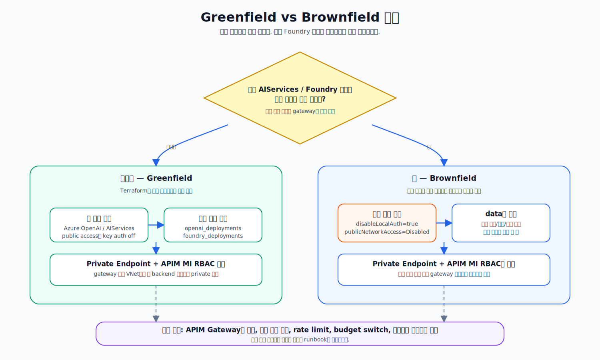

# 사전 준비

이 페이지는 배포 전에 필요한 **공통 체크리스트와 결정 항목**만 정리합니다. 모델 quota 상세, 기존 계정 보안 설정, Admin UI Entra 앱 등록 같은 실행 절차는 각 배포 페이지에서 다룹니다.

## 1. 권한과 도구

| 항목             | 필요 조건                                                                |
| -------------- | -------------------------------------------------------------------- |
| Azure 구독       | gateway 리소스(APIM, Cosmos DB, Container Apps, ACR 등)를 배포할 구독          |
| Azure RBAC     | 배포 실행자는 구독에서 `Contributor` + `User Access Administrator` 또는 동등 권한 필요 |
| Entra ID 권한    | Admin UI 배포 시 앱 등록/그룹 생성 또는 기존 객체 조회 권한 필요                           |
| Marketplace 권한 | partner/community 모델을 새로 배포할 경우 Azure Marketplace 약관 동의 권한 필요        |
| Terraform      | 1.11 이상                                                              |
| Azure CLI      | 최신 안정 버전                                                             |

```bash
terraform version
az version

az login
az account set --subscription "<subscription-id>"
```


이 가이드는 `az login`으로 얻은 Entra ID 기반 토큰을 사용합니다. 배포용 API key나 서비스 주체 시크릿을 문서 예시에 두지 않습니다.


Terraform 원격 state backend는 첫 `terraform init` 전에 한 번 부트스트랩해야 합니다. 사전 준비에서는 backend 리전, 리소스 그룹, state key 이름만 정하고, 실제 생성 명령은 선택한 배포 runbook의 backend bootstrap 단계에서 실행합니다.

## 2. 먼저 결정할 것

| 결정             | 선택지                       | 다음 페이지                                                                                            |
| -------------- | ------------------------- | ------------------------------------------------------------------------------------------------- |
| 모델 백엔드         | 신규 배포 / 기존 모델+프로젝트 없음 / 기존 모델+프로젝트 있음 | [모델 백엔드 신규 생성](03-deploy/case-foundry-greenfield.md), [모델 백엔드 기존 계정 재사용](04-reuse-foundry.md) |
| APIM 공개 여부     | public / private          | [APIM 게이트웨이 배포](03-deploy/case-apim-core-first.md)                                                |
| Admin UI 배포 여부 | 배포 / 미배포                  | [Admin UI 배포](03-deploy/case-admin-ui.md)                                                         |
| Admin 그룹       | 새 그룹 생성 / 기존 그룹 재사용       | [Admin UI 배포](03-deploy/case-admin-ui.md)                                                         |
| Entra 앱 등록     | 새 BFF/SPA 앱 생성 / 기존 앱 재사용 | [Admin UI 배포](03-deploy/case-admin-ui.md)                                                         |
| 배포 방식          | 단계적 / All-in-one          | [APIM 게이트웨이 배포](03-deploy/case-apim-core-first.md), [All-in-one 배포](03-deploy/case-all-in-one.md) |


`apim_public`, `admin_ui_public`, 모델 deployment 설정은 첫 배포 전에 확정하세요. 나중에 변경하면 APIM, Private Endpoint, Container Apps 환경이 재구성될 수 있습니다.


## 3. 모델 백엔드 결정

배포를 시작하기 전에 AIServices(Foundry) 계정을 새로 만들지, 구독 내 기존 계정을 재사용할지 결정합니다.

<figure><figcaption><p>신규 배포는 계정·프로젝트·모델을 만들고, 기존 계정 재사용은 프로젝트 유무에 따라 새 프로젝트를 만들거나 기존 프로젝트를 조회만 합니다.</p></figcaption></figure>

| 질문 | 신규 배포 | 기존 모델, 프로젝트 없음 | 기존 모델, 프로젝트 있음 |
| --- | --- | --- | --- |
| Terraform이 모델 계정을 만들까? | 예 | 아니오 | 아니오 |
| Terraform이 프로젝트를 만들까? | 예 | 예 | 아니오, 기존 프로젝트 조회만 |
| Terraform이 모델 deployment를 만들까? | 예 | 아니오 | 아니오 |
| `reuse_foundry_project` | `false` | `false` | `true` |
| 사전에 quota/약관 확인이 필요한가? | 예 | 기존 deployment 기준 확인 | 기존 deployment 기준 확인 |
| 사전에 직접 호출 경로를 차단해야 하나? | Terraform이 설정 | 고객이 설정 | 고객이 설정 |

모델 quota, partner 모델 약관, capacity 설정은 [모델 백엔드 신규 생성](03-deploy/case-foundry-greenfield.md)에서 다룹니다. 기존 계정의 보안 설정과 실제 deployment 이름 검증은 [모델 백엔드 기존 계정 재사용](04-reuse-foundry.md)에서 다룹니다.

## 4. Admin UI와 Entra 객체 결정

Admin UI를 배포하려면 Entra 값 3개가 필요합니다. 이 값은 Terraform이 직접 만들지 않고, 배포 전에 스크립트 또는 기존 객체 조회로 준비합니다.

| 값                     | tfvars 변수               | 결정                   |
| --------------------- | ----------------------- | -------------------- |
| Admin 보안 그룹 Object ID | `admin_group_object_id` | 새 그룹 생성 또는 기존 그룹 재사용 |
| BFF API audience      | `bff_api_audience`      | 새 앱 등록 또는 기존 앱 재사용   |
| SPA client ID         | `spa_client_id`         | 새 앱 등록 또는 기존 앱 재사용   |

| 상황       | 권장                                                       |
| -------- | -------------------------------------------------------- |
| 데모/검증 환경 | `app-registration.sh`로 Admin 그룹, BFF API 앱, SPA 앱을 새로 생성 |
| 고객 운영 환경 | 기존 admin 보안 그룹을 재사용하고, BFF/SPA 앱 등록만 새로 만들거나 기존 앱을 재사용   |


`app-registration.sh`는 새 Admin 그룹을 생성합니다. 기존 admin 그룹을 그대로 사용할 운영 환경에서는 스크립트를 그대로 실행하기 전에 [Admin UI 배포](03-deploy/case-admin-ui.md)의 기존 그룹 재사용 절차를 확인하세요.


SPA redirect URI는 `admin_ui_fqdn`이 나온 뒤 등록합니다. 이 작업도 [Admin UI 배포](03-deploy/case-admin-ui.md)에서 다룹니다.

## 5. 배포 경로 선택

| 목표                          | 시작 페이지                                             |
| --------------------------- | -------------------------------------------------- |
| 모델 backend와 APIM만 먼저 검증     | [APIM 게이트웨이 배포](03-deploy/case-apim-core-first.md) |
| 신규 환경에 전체 스택 배포             | [All-in-one 배포](03-deploy/case-all-in-one.md)      |
| 기존 Foundry/AIServices 계정 연결 | [모델 백엔드 기존 계정 재사용](04-reuse-foundry.md)            |
| Admin UI만 별도 배포             | [Admin UI 배포](03-deploy/case-admin-ui.md)          |

## 6. 사전 준비 완료 기준

| 항목                      | 완료 기준                                                  |
| ----------------------- | ------------------------------------------------------ |
| Azure 권한                | Terraform apply와 RBAC 할당이 가능한 권한 확보                    |
| Terraform state backend | 첫 `terraform init` 전에 backend bootstrap을 실행할 계획과 이름 확정 |
| 모델 백엔드                  | 신규 생성 또는 기존 계정 재사용 중 하나로 결정                            |
| 모델 quota/약관             | 신규 생성 경로에서 목표 모델 배포 가능 여부 확인                           |
| 기존 계정 보안                | 재사용 경로에서 API key 인증과 공용 접근 차단 계획 확정                    |
| Entra 객체                | Admin UI 배포 여부와 새 그룹/기존 그룹 방식을 결정                      |
| 공개 여부                   | `apim_public`, `admin_ui_public` 값 결정                  |
