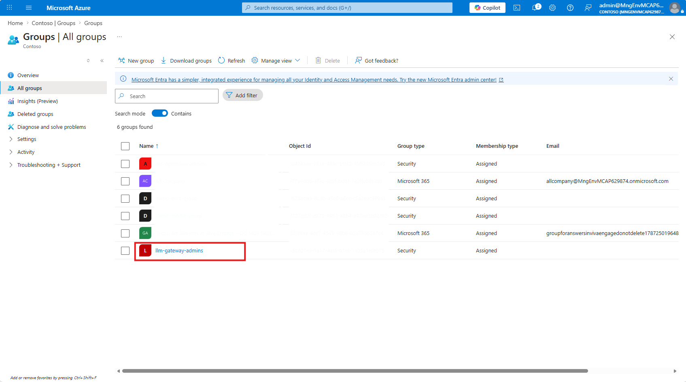
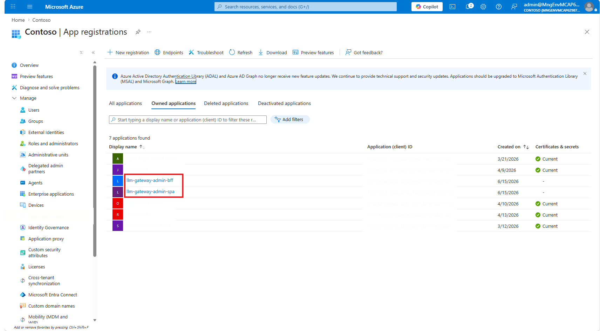

# Admin UI 배포

이 페이지는 APIM 게이트웨이가 이미 배포되어 있고 ACR이 준비된 상태에서 **Admin UI(React SPA + FastAPI BFF)** 를 배포하는 경로를 설명합니다. Admin UI를 배포하기 전에 먼저 **새 Entra admin 그룹을 만들지, 기존 그룹을 재사용할지** 결정해야 합니다.

## 1. 선택 기준


**이 경로가 맞는 경우**

* APIM 게이트웨이와 ACR이 이미 준비되어 있다.
* consumer 등록, 구독 키 발급, 정책 관리를 UI로 처리하고 싶다.
* Admin UI 쓰기 권한을 Entra admin 그룹으로 제한할 수 있다.



`admin_ui_image`를 설정하면 전용 Admin UI Container Apps 환경이 생성됩니다. `admin_ui_public`은 이 환경만 public/internal으로 선택하며 Codex proxy와 Search MCP는 항상 내부 sidecar 환경에 남습니다.


## 2. 배포 전 결정

| 결정                 | 선택지                          | 기준                                         |
| ------------------ | ---------------------------- | ------------------------------------------ |
| Admin 그룹           | 새 그룹 생성 / 기존 그룹 재사용          | 데모는 새 그룹, 운영 조직은 기존 보안 그룹 재사용              |
| Entra 앱 등록         | 새로 생성 / 기존 앱 재사용             | 새 배포는 스크립트 생성, 조직 표준 앱이 있으면 재사용            |
| Admin UI 공개 여부     | `admin_ui_public=true/false` | 외부 브라우저 접속이 필요하면 public                    |
| config-sync worker | 함께 배포 / 나중에 배포               | consumer별 동적 정책과 budget switch가 필요하면 함께 배포 |

Admin UI에는 네 가지 Entra 값이 필요합니다. 사용자가 Admin UI 화면에 직접 입력하는 값이 아니라, 배포자가 Admin UI를 켜기 전에 `terraform.tfvars`에 넣는 값입니다. 배포 후 BFF가 `/api/config`로 SPA에 내려주고, 브라우저 앱은 그 값을 사용해 MSAL 로그인을 자동 구성합니다.

| 값                     | tfvars 변수               | 역할                                             |
| --------------------- | ----------------------- | ---------------------------------------------- |
| Tenant ID             | `entra_tenant_id`       | SPA 로그인 authority와 BFF 토큰 검증에 사용할 Entra tenant |
| Admin 보안 그룹 Object ID | `admin_group_object_id` | Admin UI 쓰기 권한 허용 그룹                           |
| BFF API audience      | `bff_api_audience`      | SPA가 BFF 호출용 토큰을 받을 대상                         |
| SPA client ID         | `spa_client_id`         | React SPA의 PKCE 로그인 앱                          |

## 3. Entra ID 객체 준비

| Admin 그룹                                                                                        | 앱 등록                                                                                                             |
| ----------------------------------------------------------------------------------------------- | ---------------------------------------------------------------------------------------------------------------- |
|  |  |

### 옵션 A — 새 Admin 그룹과 앱 등록 생성

신규 데모/검증 환경에서는 스크립트를 그대로 실행합니다. 스크립트는 `AI Gateway Admins` 그룹을 만들고, 현재 로그인 사용자를 그룹에 추가한 뒤 BFF API 앱과 SPA 앱을 생성합니다.

```bash
./scripts/app-registration.sh
```

출력된 네 값을 `infra/` 디렉터리의 `terraform.tfvars` 파일에 입력합니다.

```hcl
entra_tenant_id       = "<tenant id>"
admin_group_object_id = "<created admin group object id>"
bff_api_audience      = "api://<bff app id>"
spa_client_id         = "<spa app id>"
```

스크립트가 admin consent를 자동으로 부여하지 못했다면, tenant admin 권한으로 아래 URL을 열어 SPA가 BFF API의 `access_as_user` scope를 사용할 수 있도록 동의합니다. 동의가 없거나 BFF API service principal이 없으면 로그인 중 `AADSTS650052` 오류가 발생할 수 있습니다.

```
https://login.microsoftonline.com/<tenant id>/adminconsent?client_id=<spa app id>
```

### 옵션 B — 기존 Admin 그룹 재사용

운영 조직에 이미 AI 관리자 보안 그룹이 있다면 새 그룹을 만들지 말고 기존 그룹의 Object ID를 사용합니다.

```bash
az ad group show --group "<existing-admin-group-name-or-id>" --query id -o tsv
```

`scripts/app-registration.sh`는 현재 admin 그룹도 항상 생성합니다. 기존 그룹을 재사용하려면 아래 중 하나를 선택하세요.

| 방식               | 설명                                                                  |
| ---------------- | ------------------------------------------------------------------- |
| BFF/SPA 앱만 수동 생성 | 조직 표준 Entra 앱 등록 절차로 BFF API audience와 SPA client ID 준비             |
| 스크립트 일부만 실행      | `app-registration.sh`에서 admin group 생성 부분을 제외하고 BFF/SPA 앱 등록 부분만 실행 |
| 기존 BFF/SPA 앱 재사용 | 기존 앱의 audience와 client ID를 조회해 tfvars에 입력                           |

기존 앱을 재사용하는 경우 값은 아래처럼 조회합니다.

```bash
az account show --query tenantId -o tsv
az ad app show --id "<bff-app-id>" --query "identifierUris[0]" -o tsv
az ad app show --id "<spa-app-id>" --query appId -o tsv
```

기존 앱을 재사용할 때도 BFF API app과 SPA app의 service principal이 tenant에 존재해야 하며, SPA에 BFF API `access_as_user` delegated permission과 admin consent가 필요합니다.

## 4. 이미지 빌드

ACR은 APIM 게이트웨이 배포 단계에서 이미 만들어져 있어야 합니다. `infra/` 디렉터리에서 Admin UI 이미지를 빌드합니다.

```bash
acr=$(terraform output -raw registry_login_server)
reg=$(terraform output -raw registry_name)
tag="$(git rev-parse --short=12 HEAD)"

az acr build --registry "$reg" --image "admin-ui:${tag}" ../app/admin-ui
az acr repository update --name "$reg" --image "admin-ui:${tag}" --write-enabled false --output none
az acr repository show-tags --name "$reg" --repository admin-ui --orderby time_desc -o table
```

config-sync worker도 같은 apply에서 배포하려면 함께 빌드합니다.

```bash
az acr build --registry "$reg" --image "config-sync-worker:${tag}" ../app/config-sync-worker
az acr repository update --name "$reg" --image "config-sync-worker:${tag}" --write-enabled false --output none
az acr repository show-tags --name "$reg" --repository config-sync-worker --orderby time_desc -o table
```

Git SHA 태그도 기본적으로 덮어쓸 수 있으므로, 위 명령은 build 직후 배포할 태그를 잠급니다. 자세한 내용은 [ACR 이미지 잠금](https://learn.microsoft.com/azure/container-registry/container-registry-image-lock)을 참고하세요.

## 5. tfvars 핵심값

아래 값은 `infra/` 디렉터리의 `terraform.tfvars` 파일에서 수정합니다. `admin_ui_public`은 이 apply에서 생성되는 전용 Admin UI 환경의 노출 방식만 선택합니다.

```hcl
admin_ui_image        = "<registry_login_server>/admin-ui:<git-sha>"
entra_tenant_id       = "<tenant id>"
admin_group_object_id = "<entra security group object id>"
bff_api_audience      = "api://<bff app id>"
spa_client_id         = "<spa app id>"

# worker도 함께 배포할 때만 설정
worker_image = "<registry_login_server>/config-sync-worker:<git-sha>"
```

| 변수                      | 의미                                                                               |
| ----------------------- | -------------------------------------------------------------------------------- |
| `admin_ui_image`        | Admin UI 컨테이너 이미지 전체 URI                                                         |
| `admin_ui_public`       | Admin UI public FQDN 노출 여부                                                       |
| `entra_tenant_id`       | Admin UI 로그인에 사용할 Entra tenant ID. `az account show --query tenantId -o tsv`로 확인 |
| `admin_group_object_id` | Admin UI 쓰기 권한을 가진 Entra 보안 그룹                                                   |
| `bff_api_audience`      | BFF API 토큰 audience                                                              |
| `spa_client_id`         | SPA public-client app ID                                                         |
| `worker_image`          | config-sync worker 이미지. 비워 두면 worker 미배포                                         |

`entra_tenant_id`는 Admin UI 배포 시 항상 필요합니다. `client_auth_mode="entra-id"`로 APIM 클라이언트 인증까지 Entra ID로 바꾸는 경우에도 같은 값을 사용합니다.

## 6. Terraform apply

```bash
cd infra
terraform apply
```

완료 후 Admin UI FQDN을 확인합니다.

```bash
terraform output admin_ui_fqdn
```

## 7. SPA redirect URI 등록

Admin UI FQDN이 확정되면 SPA 앱 등록의 redirect URI에 추가합니다.

```bash
spa_app_id="<spa_client_id>"
admin_ui_fqdn="$(terraform output -raw admin_ui_fqdn)"
spa_object_id="$(az ad app show --id "$spa_app_id" --query id -o tsv)"

az rest --method PATCH \
  --uri "https://graph.microsoft.com/v1.0/applications/${spa_object_id}" \
  --headers "Content-Type=application/json" \
  --body "{\"spa\":{\"redirectUris\":[\"https://${admin_ui_fqdn}\"]}}"
```

## 8. 검증

| 확인 항목              | 기대 결과                                           |
| ------------------ | ----------------------------------------------- |
| Admin UI 접속        | `https://<admin_ui_fqdn>`에서 Entra 로그인 화면 표시     |
| 그룹 멤버 로그인          | consumer 등록, 구독 키 발급, 정책 수정 가능                  |
| 그룹 비멤버 로그인         | 쓰기 작업 차단 또는 접근 거부                               |
| config-sync worker | worker를 배포한 경우 Cosmos 설정이 APIM named value로 동기화 |


`admin_ui_public=true`여도 Admin UI는 Entra ID 인증과 admin 그룹 검사를 통과해야 사용할 수 있습니다. public FQDN은 로그인 페이지 접근을 위한 노출이며 인증 우회가 아닙니다.


## 9. 다음 단계

| 목적                  | 이동                                               |
| ------------------- | ------------------------------------------------ |
| consumer 등록과 key 발급 | [운영](../06-operate.md)                           |
| APIM 직접 호출          | [직접 API 호출](../07-connect-clients/direct-api.md) |
| 클라이언트 연결            | [클라이언트 온보딩](../07-connect-clients.md)            |
