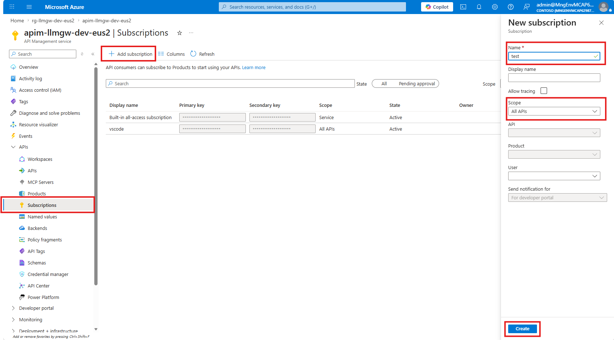

# APIM 게이트웨이 배포

이 페이지는 모델 백엔드 방식을 먼저 결정한 뒤, **Admin UI와 config-sync worker 없이 APIM 게이트웨이만 먼저 배포**하는 단계적 배포 경로를 설명합니다. 이 단계만으로도 APIM 정책, 모델 라우팅, Private Endpoint/RBAC 연결, 기본 호출 검증까지 가능합니다.

## 1. 선택 기준


**이 경로가 맞는 경우**

* 모델 백엔드 경로를 이미 결정했다.
* Admin UI 없이 APIM gateway 호출부터 검증하고 싶다.
* 구독 키를 Azure Portal 또는 CLI에서 수동 발급해도 된다.
* consumer별 동적 정책과 budget switch는 다음 단계에서 붙여도 된다.


모델 백엔드가 아직 결정되지 않았다면 먼저 [모델 백엔드 신규 생성](case-foundry-greenfield.md) 또는 [모델 백엔드 기존 계정 재사용](../04-reuse-foundry.md)을 선택하세요.

## 2. 배포되는 리소스

| 리소스                     | 포함 여부 | 설명                                                          |
| ----------------------- | ----: | ----------------------------------------------------------- |
| APIM + API 경로           |     예 | `/openai`, `/vscode/models`, `/foundry`, `/responses`      |
| APIM 정책                 |     예 | consumer 식별, allowed model, rate limit, 모델 전환, token metric |
| 모델 백엔드 연결               |     예 | 신규 생성 또는 기존 계정 재사용 중 선택한 경로                                 |
| Private Endpoint / RBAC |     예 | APIM VNet에서 backend 계정으로 private 연결                         |
| Cosmos DB / ACR / VNet  |     예 | 이후 Admin UI·worker 추가를 위한 기반 리소스                            |
| Admin UI                |   아니오 | 다음 단계에서 추가                                                  |
| config-sync worker      |   아니오 | 다음 단계에서 추가                                                  |


이 단계의 거버넌스는 `infra/terraform.tfvars`에 들어간 기본 설정을 사용합니다. consumer별 override와 예산 기반 동적 모델 전환은 config-sync worker를 추가한 뒤 완전해집니다.


## 3. 배포 전 확인

| 항목         | 확인할 내용                                 |
| ---------- | -------------------------------------- |
| 모델 백엔드     | 신규 생성 또는 기존 계정 재사용 중 하나를 선택            |
| 모델 이름      | `model_deployments`의 key와 실제 deployment 이름이 일치 |
| APIM 공개 여부 | 외부 개발 도구 연결이 필요하면 `apim_public=true`   |
| 기존 계정 재사용  | project management enabled, local auth disabled, public access disabled 완료 |
| 이미지 변수     | `worker_image=""`, `admin_ui_image=""` |


`apim_public`과 모델 backend 설정은 첫 apply 전에 확정하세요. 나중에 바꾸면 APIM 정책, Private Endpoint, RBAC, VNet 구성을 다시 적용해야 합니다.


## 4. tfvars 핵심값

이 단계에서 `infra/terraform.tfvars` 파일을 처음 만들고 채웁니다. 모델 백엔드 값([모델 백엔드 신규 생성](case-foundry-greenfield.md#4-tfvars-입력값-결정) 또는 [기존 계정 재사용](../04-reuse-foundry.md#4-tfvars-입력값-결정)에서 결정)도 여기서 입력합니다. 파일이 없으면 `terraform.tfvars.example`을 복사해 만들고, 아래 값이 없으면 직접 추가합니다.

```bash
cp infra/terraform.tfvars.example infra/terraform.tfvars
```

먼저 모든 배포 경로에 필요한 공통 값을 채웁니다. 기본값이 없는 값은 비워 두면 `terraform plan`/`apply` 중 입력을 요구하므로 파일에 명시합니다.

```
prefix               = "aigw"
env                  = "dev"
location             = "eastus2"
owner                = "<owner-or-team-email>"
cost_center          = "<cost-center>"
apim_publisher_name  = "<publisher-name>"
apim_publisher_email = "<publisher-email>"
apim_sku_name        = "Developer_1"

# 외부 개발 도구에서 APIM gateway를 직접 호출해야 하면 true
apim_public = true

monthly_budget_amount = 200
budget_alert_email    = "<alert-email>"
budget_start_date     = "2026-07-01T00:00:00Z"   # 과거 날짜 금지(첫 apply 시점 기준 당월 1일)
```

그 다음 모델 백엔드 경로를 하나만 선택합니다. 신규 생성 경로는 기본값을 그대로 써도 되지만, quota/capacity를 명확히 고정하려면 파일에 적습니다.

```
reuse_foundry = false
foundry_project_name                  = "codexproj"
foundry_public_network_access_enabled = false
legacy_gpt_compat_enabled             = false
admin_ui_legacy_gpt_aliases_enabled   = false

model_deployments = {
  "gpt-5.6-sol" = {
    model_name    = "gpt-5.6-sol"
    model_format  = "OpenAI"
    model_version = "2026-07-09"
    sku_name      = "GlobalStandard"
    capacity      = 500
  }
  "FW-GLM-5.2" = {
    model_name    = "FW-GLM-5.2"
    model_format  = "Fireworks"
    model_version = "1"
    sku_name      = "DataZoneStandard"
    capacity      = 500
  }
  "DeepSeek-V4-Pro" = {
    model_name    = "DeepSeek-V4-Pro"
    model_format  = "DeepSeek"
    model_version = "2026-04-23"
    sku_name      = "GlobalStandard"
    capacity      = 500
  }
  "grok-4.3" = {
    model_name    = "grok-4.3"
    model_format  = "xAI"
    model_version = "1"
    sku_name      = "GlobalStandard"
    capacity      = 10
  }
}
```

`reuse_foundry=true`는 state에 managed `project_account`가 없는 **external-final 계정**에만 사용합니다. 이 경로에서는 canonical deployment가 기존 계정에 이미 있어야 하고, 기존 `codexproj`/gateway PE/APIM 역할은 exact account ID·principal ID·role·resource ID를 확인한 뒤 import합니다. Sidecar-era state가 `project_account`/`project`/`project_models`를 이미 소유하면 [기존 state 분류](../04-reuse-foundry.md#기존-state-분류)에 따라 `reuse_foundry=false`와 exact `foundry_account_name`을 사용하며 APIM 역할을 `state mv`하지 않습니다.

```
reuse_foundry         = true
existing_foundry_name = "<existing-aiservices-account-name>"
existing_foundry_rg   = "<existing-aiservices-resource-group>"

model_deployments = {
  "gpt-5.6-sol" = {
    model_name    = "gpt-5.6-sol"
    model_format  = "OpenAI"
    model_version = "2026-07-09"
    sku_name      = "GlobalStandard"
    capacity      = 500
  }
  "FW-GLM-5.2" = {
    model_name    = "FW-GLM-5.2"
    model_format  = "Fireworks"
    model_version = "1"
    sku_name      = "DataZoneStandard"
    capacity      = 500
  }
  "DeepSeek-V4-Pro" = {
    model_name    = "DeepSeek-V4-Pro"
    model_format  = "DeepSeek"
    model_version = "2026-04-23"
    sku_name      = "GlobalStandard"
    capacity      = 500
  }
  "grok-4.3" = {
    model_name    = "grok-4.3"
    model_format  = "xAI"
    model_version = "1"
    sku_name      = "GlobalStandard"
    capacity      = 10
  }
}
```

마지막으로 이 페이지에서는 APIM gateway만 먼저 배포하므로 Admin UI와 worker 이미지는 비워 둡니다. 기존 `terraform.tfvars`에 이미지 값이 남아 있으면 이 단계에서 Admin UI/worker도 같이 배포됩니다.

```

worker_image         = ""
admin_ui_image       = ""
codexproxy_image     = ""
route_via_codexproxy = false

# in-VNet 테스트용 VM이 필요할 때만 true
enable_jumpbox = false
```

| 변수                                                               | 의미                              |
| ---------------------------------------------------------------- | ------------------------------- |
| `owner`, `cost_center`, `apim_publisher_*`, `budget_alert_email` | 기본값이 없어 파일에 넣어야 하는 공통 값         |
| `reuse_foundry`                                                  | 모델 백엔드 신규 생성/기존 계정 재사용 선택       |
| `model_deployments`                                              | canonical 네 모델 또는 운영자가 승인한 동일 schema deployment 정의 |
| `legacy_gpt_compat_enabled`                                      | live migration 중 GPT-family policy 호환. fresh/final은 `false` |
| `admin_ui_legacy_gpt_aliases_enabled`                            | live migration 중 Admin UI legacy alias 노출. fresh/final은 `false` |
| `worker_image`                                                   | 비워 두면 config-sync worker 미배포    |
| `admin_ui_image`                                                 | 비워 두면 Admin UI 미배포              |

## 5. Terraform backend와 apply

처음 배포하는 구독이나 새 테스트 스택이면 `terraform init` 전에 state backend를 먼저 만듭니다. 이 단계는 Terraform이 관리하는 gateway 리소스가 아니라, Terraform state를 저장할 운영자용 저장소를 준비하는 작업입니다.

아래 값은 파일이 아니라 **터미널에 그대로 입력**합니다. 4개 값을 본인 환경에 맞게 바꾼 뒤 스크립트를 실행하면, 스크립트가 storage account를 만들고 `infra/providers.tf`의 backend 블록을 자동으로 채워 줍니다. 이 블록은 **레포 루트**(`./scripts/...` 경로 기준)에서 실행합니다. (여기 `location`은 backend 저장소 리전이며, gateway 리전은 `terraform.tfvars`의 `location`에서 따로 정합니다.)

```bash
# 레포 루트에서 실행
location="eastus2"                              # backend 저장소 리전
backend_rg="rg-aigw-tfstate-dev-eastus2"        # state용 리소스 그룹
storage_prefix="staigwtfstate"                  # storage 계정 접두사(<=18자, 소문자+숫자)
state_key="ai-gateway-eus2.tfstate"             # state blob 이름

./scripts/bootstrap-backend.sh \
  --location "$location" \
  --backend-rg "$backend_rg" \
  --storage-prefix "$storage_prefix" \
  --state-key "$state_key"
```

같은 워킹카피에서 backend 리소스 그룹이나 storage account를 삭제한 뒤 다시 bootstrap했다면, 로컬 `.terraform` 디렉터리에 이전 backend 설정이 남아 있을 수 있습니다. 이 경우 첫 초기화는 `terraform init -reconfigure`로 실행합니다.

이미 같은 스택의 backend가 `infra/providers.tf`에 설정되어 있으면 bootstrap은 다시 실행하지 않습니다.

```bash
cd infra
terraform init
terraform plan
terraform apply
```

External-final 계정에 `reuse_foundry=true`를 사용하는 경우 기존 AIServices 계정과 모델 deployment가 생성 또는 변경 대상이 아닌지 확인하고, [기존 state 분류와 plan 검증](../04-reuse-foundry.md#기존-state-분류)을 따릅니다.

APIM VNet 주입이 포함된 첫 apply는 약 45분 걸릴 수 있습니다. 완료 후 gateway URL을 확인합니다.

```bash
terraform output apim_gateway_url
terraform output resource_group_name
```

## 6. 구독 키 발급

Admin UI가 아직 없으므로 APIM subscription key는 Azure Portal 또는 Azure CLI로 수동 발급합니다. 운영 가이드에는 Portal 화면을 함께 보여주는 편이 이해하기 쉽습니다.

| 방식           | 언제 사용하나                       |
| ------------ | ----------------------------- |
| Azure Portal | 고객 설명, 스크린샷 기반 가이드, 1회성 수동 발급 |
| Azure CLI    | 자동화, 반복 발급, runbook 검증        |

### Azure Portal에서 발급

Azure Portal에서 APIM 인스턴스를 열고 **Subscriptions** 메뉴에서 새 subscription을 만듭니다.

<figure><figcaption><p>Azure Portal → API Management → Subscriptions → Add subscription</p></figcaption></figure>

| 입력값          | 예시                      |
| ------------ | ----------------------- |
| Display name | `team-a-dev`            |
| Scope        | All APIs 또는 테스트할 API 범위 |

생성 후 subscription의 **Primary key** 또는 **Secondary key**를 복사합니다. 이 값이 클라이언트에서 사용할 APIM subscription key이며, 같은 key를 `/openai`, `/vscode/models`, `/foundry` 경로에 모두 사용할 수 있습니다. 경로별로 헤더 이름만 다릅니다.

### Azure CLI로 발급

Azure CLI 버전에 따라 `az apim subscription` 하위 명령이 없을 수 있으므로, 아래 예시는 APIM management REST API를 `az rest`로 호출합니다.

먼저 값 4개를 채웁니다. APIM 이름과 RG는 배포 출력에서 얻고, **subscription id는 새로 만들 구독 객체의 이름(직접 정하는 슬러그)** 입니다. 키가 아니라 식별자이며, 실제 키는 생성 뒤 `listSecrets`로 조회합니다.

```bash
# infra/ 디렉터리에서 실행 — 배포 출력에서 자동 추출
resource_group_name="$(terraform output -raw resource_group_name)"
apim_name="$(terraform output -raw apim_gateway_url | sed -E 's#https://([^.]+)\..*#\1#')"
azure_subscription_id="$(az account show --query id -o tsv)"

# 직접 정하는 값: 새 consumer 구독 식별자(예: team-a-dev)
apim_subscription_id="team-a-dev"

az rest --method put \
  --uri "https://management.azure.com/subscriptions/${azure_subscription_id}/resourceGroups/${resource_group_name}/providers/Microsoft.ApiManagement/service/${apim_name}/subscriptions/${apim_subscription_id}?api-version=2022-08-01" \
  --body '{
    "properties": {
      "displayName": "team-a-dev",
      "scope": "/apis",
      "state": "active"
    }
  }'
```

생성 시 키는 입력하지 않습니다. Azure가 자동 발급하며 아래로 조회합니다.

```bash
az rest --method post \
  --uri "https://management.azure.com/subscriptions/${azure_subscription_id}/resourceGroups/${resource_group_name}/providers/Microsoft.ApiManagement/service/${apim_name}/subscriptions/${apim_subscription_id}/listSecrets?api-version=2022-08-01"
```

참고: [APIM Subscription Create or Update](https://learn.microsoft.com/en-us/rest/api/apimanagement/subscription/create-or-update), [APIM Subscription List Secrets](https://learn.microsoft.com/en-us/rest/api/apimanagement/subscription/list-secrets)

## 7. 호출 검증

발급한 키로 스모크 테스트를 실행합니다. `<apim-host>`는 `https://`와 경로를 뺀 **호스트 이름만** 넣습니다(스크립트가 내부에서 `https://<host>/openai/...`로 조립).

```bash
# infra/ 디렉터리에서: 게이트웨이 호스트만 추출
apim_host="$(terraform output -raw apim_gateway_url | sed -E 's#https?://##; s#/.*##')"   # 예: apim-aigw-dev-eus2.azure-api.net
./scripts/smoke-v1-gateway.sh "$apim_host" "<subscription-key>"
```

| 확인 항목            | 기대 결과                           |
| ---------------- | ------------------------------- |
| `/openai`        | gpt 계열 모델 호출 성공                 |
| `/vscode/models` | VS Code BYOK 경로 호출 성공           |
| `/foundry`       | Foundry/partner 모델 호출 성공        |
| 403/429          | 모델 미허용 또는 rate limit 초과 시 정책 응답 |


스크립트는 `gpt-5.6-sol`, `FW-GLM-5.2`, `grok-4.3`, `DeepSeek-V4-Pro` 배포 이름을 직접 호출합니다. 이 이름이 `model_deployments`와 실제 deployment에 없으면 해당 항목은 403/404로 실패합니다. 배포한 모델 이름이 다르면 `scripts/smoke-v1-gateway.sh`의 모델 값을 본인 환경에 맞게 수정하세요. `apim_public=false`이면 노트북 대신 점프박스/VNet 안에서 실행합니다.


## 8. 다음 단계

| 목적                       | 이동                                               |
| ------------------------ | ------------------------------------------------ |
| Admin UI 배포              | [Admin UI 배포](case-admin-ui.md)                  |
| worker와 Admin UI까지 전체 배포 | [All-in-one 배포](case-all-in-one.md)              |
| 직접 HTTP 호출               | [직접 API 호출](../07-connect-clients/direct-api.md) |
| 클라이언트 연결                 | [클라이언트 온보딩](../07-connect-clients.md)            |
