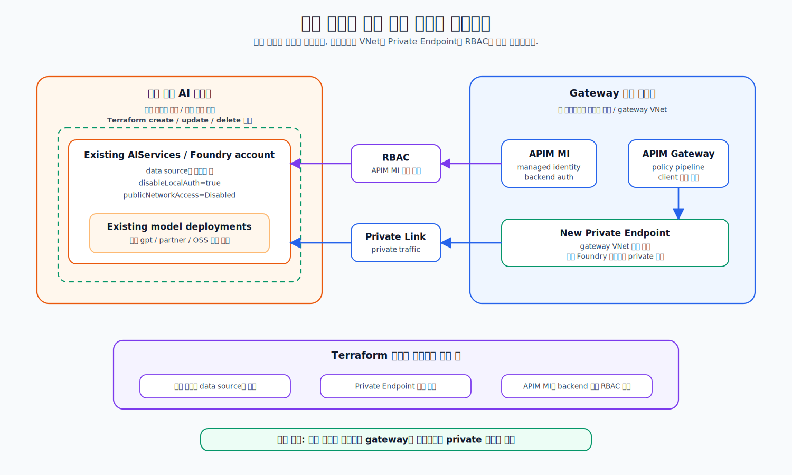

# 모델 백엔드 기존 계정 재사용

이 페이지는 이미 운영 중인 Azure AIServices(Foundry) 계정과 모델 배포를 **그대로 유지**하고, gateway VNet에서 Private Endpoint와 APIM managed identity RBAC만 새로 추가하는 brownfield 경로를 설명합니다.

<figure><figcaption><p>기존 계정과 모델 배포는 Terraform 소유 리소스로 편입하지 않고, gateway 쪽 연결 리소스만 추가합니다.</p></figcaption></figure>

## 1. 선택 기준


**이 경로가 맞는 경우**

* 고객 구독에 이미 운영 중인 AIServices/Foundry 계정이 있다.
* 기존 모델 deployment를 만들거나 삭제하지 않고 그대로 보존해야 한다.
* Terraform이 기존 계정과 모델을 소유 리소스로 가져오면 안 된다.
* gateway와 기존 계정이 같은 Azure 구독에 있다.



현재 재사용 모드는 **같은 Azure 구독** 내 기존 계정만 지원합니다. 다른 구독의 Foundry 계정을 재사용하는 경로는 지원 범위 밖입니다.


## 2. 재사용 방식

| 리소스              | 신규 생성 경로      | 기존 계정 재사용 경로          |
| ---------------- | ------------- | --------------------- |
| AIServices 계정    | Terraform이 생성 | `data` 소스로 읽기만 함      |
| 모델 배포            | Terraform이 생성 | 생성/수정/삭제 안 함          |
| 계정 보안/프로젝트 설정    | Terraform이 설정 | 배포 전 고객이 `az` CLI로 설정 |
| Private Endpoint | 생성            | gateway VNet에 새로 생성   |
| APIM MI RBAC     | 부여            | 기존 계정 scope에 부여       |

재사용 모드(`reuse_foundry=true`)에서는 별도 Azure OpenAI 계정을 만들지 않습니다. canonical 네 모델(`gpt-5.6-sol`, `FW-GLM-5.2`, `DeepSeek-V4-Pro`, `grok-4.3`)을 포함한 `/openai`·`/vscode/models`·`/foundry` 요청은 기존 AIServices 계정의 canonical OpenAI/v1 account path(`https://<account>.openai.azure.com/openai/v1`)로 라우팅됩니다. 반면 `/responses`는 Codex proxy sidecar를 거쳐 같은 계정 아래 canonical project `codexproj`의 Responses path(`/api/projects/codexproj/openai/v1/responses`)를 호출합니다.

## 3. 배포 전 기존 계정 보안 설정

gateway는 APIM managed identity와 RBAC로 backend를 호출합니다. 따라서 Terraform apply 전에 기존 계정이 이미 **project management enabled**, **API key 인증 비활성화**, **공용 네트워크 접근 차단** 상태여야 합니다.

관련 공식 문서:

* [Foundry Models sold by Azure — GPT-5.6](https://learn.microsoft.com/azure/foundry/foundry-models/concepts/models-sold-directly-by-azure#gpt-56)
* [Configure private link for Azure AI Foundry resources](https://learn.microsoft.com/azure/foundry/how-to/configure-private-link)
* [Authenticate with managed identity](https://learn.microsoft.com/azure/api-management/api-management-authenticate-authorize-ai-apis#authenticate-with-managed-identity)

| 설정                    | 기대값        | 이유                       |
| --------------------- | ---------- | ------------------------ |
| `allowProjectManagement` | `true`   | canonical child project를 같은 계정 아래에 생성 |
| `disableLocalAuth`    | `true`     | API key 기반 직접 호출 차단      |
| `publicNetworkAccess` | `Disabled` | public endpoint 직접 접근 차단 |

먼저 계정 resource ID를 확인합니다.

```bash
az resource list \
  --resource-type "Microsoft.CognitiveServices/accounts" \
  --query "[].{name:name, resourceId:id, rg:resourceGroup}" \
  -o table
```

project management, API key 인증, 공용 네트워크 접근을 최종 상태로 맞춥니다.

```bash
az resource update --ids <aiservices-account-id> \
  --set properties.allowProjectManagement=true properties.disableLocalAuth=true properties.publicNetworkAccess=Disabled
```

설정 상태를 확인합니다.

```bash
az resource show --ids <aiservices-account-id> \
  --query "properties.{allowProjectManagement:allowProjectManagement, disableLocalAuth:disableLocalAuth, publicNetworkAccess:publicNetworkAccess}" -o jsonc
```

기대 출력:

```json
{
  "allowProjectManagement": true,
  "disableLocalAuth": true,
  "publicNetworkAccess": "Disabled"
}
```


`publicNetworkAccess=Disabled`로 설정하면 기존 public endpoint에 직접 붙던 클라이언트가 즉시 차단됩니다. 유지보수 창을 잡고 **보안 설정 변경 → gateway apply → 검증** 순서를 한 번에 진행하세요.


## 4. tfvars 입력값 결정

여기서는 값만 결정합니다. 실제 `infra/terraform.tfvars` 파일 생성과 입력은 [APIM 게이트웨이 배포](03-deploy/case-apim-core-first.md#4-tfvars-핵심값) 단계에서 합니다. 기존 계정의 실제 deployment 이름을 확인한 뒤 아래 형태로 옮겨 적습니다.

```
reuse_foundry         = true
existing_foundry_name = "ais-customer-prod"
existing_foundry_rg   = "rg-customer-ai"
foundry_project_name  = "codexproj"

model_deployments = {
  "gpt-5.6-sol" = {
    model_name    = "gpt-5.6-sol"
    model_format  = "OpenAI"
    model_version = "2026-07-09"
    sku_name      = "GlobalStandard"
    capacity      = 500
  }
  "FW-GLM-5.2" = {
    model_name    = "FW-GLM-5.2"
    model_format  = "Fireworks"
    model_version = "1"
    sku_name      = "DataZoneStandard"
    capacity      = 500
  }
  "DeepSeek-V4-Pro" = {
    model_name    = "DeepSeek-V4-Pro"
    model_format  = "DeepSeek"
    model_version = "2026-04-23"
    sku_name      = "GlobalStandard"
    capacity      = 500
  }
  "grok-4.3" = {
    model_name    = "grok-4.3"
    model_format  = "xAI"
    model_version = "1"
    sku_name      = "GlobalStandard"
    capacity      = 10
  }
}
```

| 변수                      | 의미                            |
| ----------------------- | ----------------------------- |
| `reuse_foundry`         | `true`면 기존 계정 재사용 모드 활성화      |
| `existing_foundry_name` | 재사용할 AIServices 계정 이름         |
| `existing_foundry_rg`   | 기존 계정이 있는 리소스 그룹              |
| `foundry_project_name`  | canonical child project 이름 (`codexproj`) |
| `model_deployments`     | 기존 계정에 이미 존재하는 canonical deployment 선언 |


`model_deployments`의 **map key는 기존 계정에 이미 존재하는 실제 deployment 이름과 대소문자까지 정확히 일치**해야 합니다. 기본 runbook은 canonical 네 모델을 기대하며, 다른 이름을 쓰려면 `model_deployments`와 이후 smoke/config 예시를 함께 맞춰야 합니다.


재사용 모드에서는 `model_deployments`를 선언만 하고, 해당 deployment들은 외부 AIServices 계정에 **이미 존재**해야 합니다. Terraform은 이 계정과 모델을 생성하거나 수정하지 않습니다.

## 5. Plan 검증

이 페이지에서 state backend를 먼저 만들지는 않습니다. 기존 계정 보안 설정과 `terraform.tfvars` 입력을 끝낸 뒤, 선택한 배포 runbook의 backend bootstrap 단계를 진행하고 첫 `terraform plan`에서 기존 계정/모델이 생성 또는 변경 대상이 아닌지 확인합니다.

같은 워킹카피에서 backend 리소스 그룹이나 storage account를 삭제한 뒤 다시 bootstrap했다면, 로컬 `.terraform` 디렉터리에 이전 backend 설정이 남아 있을 수 있습니다. 이 경우 첫 초기화는 `terraform init -reconfigure`로 실행합니다.

```bash
cd infra
terraform init
terraform plan
```


이전 버전을 이미 `reuse_foundry=true`로 적용한 state를 업그레이드한다면 첫 plan 전에 [기존 reuse state의 APIM RBAC 주소 전환](06-operate.md#기존-reuse-state의-apim-rbac-주소-전환)을 먼저 수행하세요. 새 brownfield 배포나 `reuse_foundry=false`였던 managed 이력에는 이 state move를 적용하지 않습니다.


| 확인 항목                             | 기대값 |
| --------------------------------- | --- |
| `azurerm_cognitive_account` 생성    | 0   |
| `azurerm_cognitive_deployment` 생성 | 0   |
| Foundry Private Endpoint          | 생성됨 |
| APIM managed identity RBAC        | 생성됨 |
| destroy 대상                        | 0   |


plan 결과가 “기존 계정/모델 생성 0, Private Endpoint + RBAC만 추가”이면 재사용 경로가 올바르게 설정된 것입니다.



plan에 `destroy` 또는 기존 AIServices 계정 변경이 보이면 apply하지 말고 `reuse_foundry`, `existing_foundry_name`, `existing_foundry_rg`, `model_deployments` 값을 다시 확인하세요.


## 6. APIM 배포와의 관계

기존 계정 재사용도 APIM과 따로 나중에 붙이는 방식이 아닙니다. 위 보안 설정과 tfvars를 먼저 완료한 뒤 [APIM 게이트웨이 배포](03-deploy/case-apim-core-first.md) 또는 [All-in-one 배포](03-deploy/case-all-in-one.md)의 첫 apply에서 gateway 연결 리소스가 함께 생성됩니다.

| 목적                | 이동                                                         |
| ----------------- | ---------------------------------------------------------- |
| APIM 게이트웨이만 먼저 검증 | [APIM 게이트웨이 배포](03-deploy/case-apim-core-first.md)         |
| 전체 스택 배포          | [All-in-one 배포](03-deploy/case-all-in-one.md)              |
| 배포 후 호출 확인        | [APIM 게이트웨이 배포](03-deploy/case-apim-core-first.md#7-호출-검증) |
