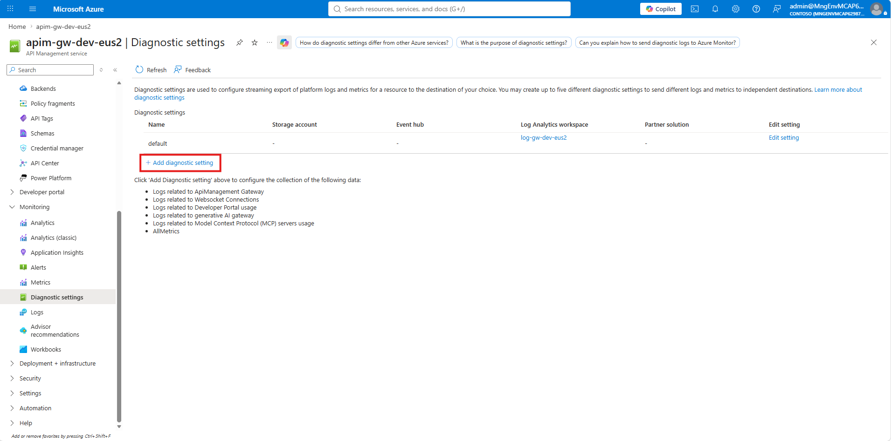
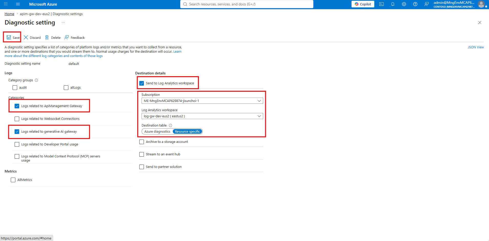
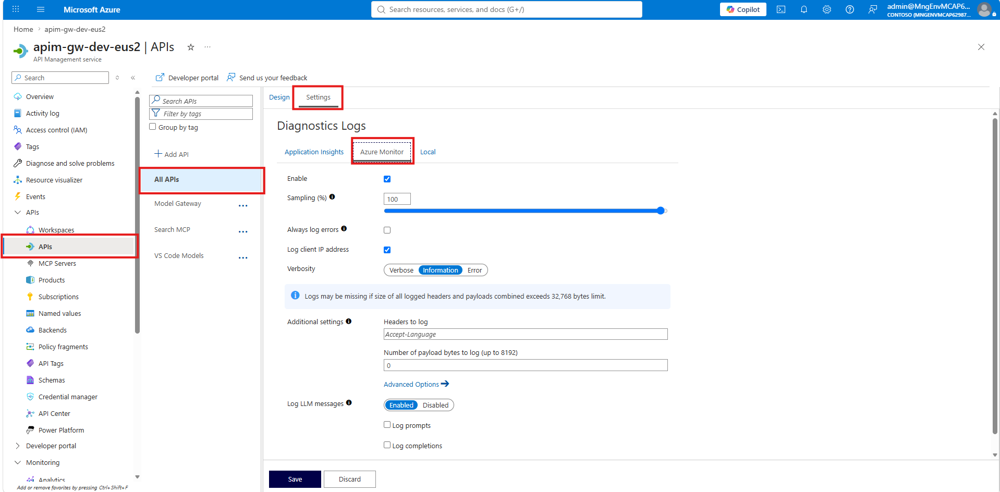
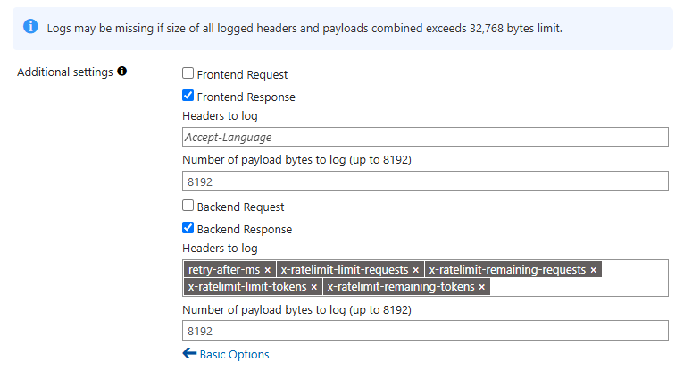
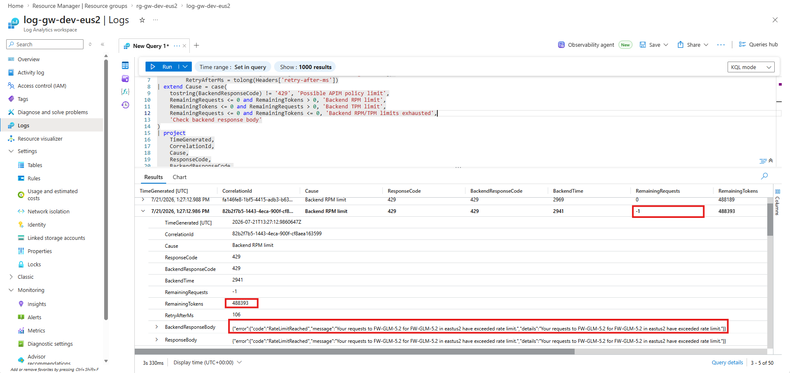

# 운영

이 페이지는 배포 이후 플랫폼팀이 반복적으로 수행하는 **consumer/API key 운영, 정책 반영, 모니터링, 비용 제어, 스케일 변경, 리소스 정리** 절차를 정리합니다. 배포 직후 호출 확인은 각 배포 페이지의 검증 절에서 처리하고, 이 페이지는 운영 중 변경과 진단에 집중합니다.

## 1. 운영 범위


**이 페이지가 다루는 것**

- Admin UI에서 consumer 등록, API key 발급, 모델 권한·티어·예산 정책 변경
- config-sync worker로 Cosmos DB 설정을 APIM Named Value에 반영
- Admin UI Monitoring과 Application Insights로 요청·차단·모델 전환 이벤트 확인
- 예산 기반 모델 전환, 가격 데이터 갱신, 월 예산 알림 운영
- APIM SKU, 모델 capacity, 공개 모드 변경과 리소스 정리


| 운영 작업 | 주로 사용하는 위치 |
|---|---|
| consumer 등록 / API key 발급 | Admin UI → Consumers |
| 모델 허용 목록 / rate tier / budget 변경 | Admin UI → Policies |
| 변경 즉시 반영 | Azure Container Apps Job `config-sync` |
| 요청·차단·모델 전환 확인 | Admin UI → Monitoring, Application Insights |
| 인프라 규모 변경 | `infra/terraform.tfvars` + `terraform apply` |


Admin UI는 Entra ID 로그인과 admin 보안 그룹으로 보호됩니다. public FQDN을 노출하더라도 그룹 권한을 통과하지 못하면 쓰기 작업을 수행할 수 없습니다.


## 2. 설정 변경

### Admin UI 접속

```bash
cd infra
terraform output -raw admin_ui_fqdn
```

브라우저에서 출력된 URL을 열고 admin 보안 그룹에 속한 계정으로 로그인합니다. `admin_ui_public=false`인 환경은 private DNS를 해석할 수 있는 VNet 연결 경로에서 접근해야 합니다.

### Consumer와 API key 운영

Admin UI의 **Consumers** 탭에서 팀·서비스 단위 consumer를 등록하고 APIM subscription key를 발급합니다.

| 작업 | 위치 | 결과 |
|---|---|---|
| consumer 등록 | Consumers → New Consumer | 정책 적용 대상 생성 |
| API key 발급 | Consumers → Keys → Generate | 클라이언트 호출용 subscription key 생성 |
| consumer 비활성화 | Consumers → Disable | 해당 consumer 호출 차단 |

발급된 key는 클라이언트가 `Ocp-Apim-Subscription-Key` 또는 `api-key` 헤더로 전달합니다. 클라이언트별 헤더와 base URL은 [클라이언트 온보딩](07-connect-clients.md)을 참고하세요.

### 정책 변경

Admin UI의 **Policies** 탭에서 consumer별 운영 정책을 조정합니다.

| 정책 | 의미 | 운영 영향 |
|---|---|---|
| Allowed models | 호출 가능한 모델 목록 | 목록 밖 모델은 `403 Forbidden` |
| Rate tier | 분당 토큰과 일별 토큰 쿼터 | 초과 시 `429 Too Many Requests` |
| Daily budget | consumer별 일별 USD 예산 | 임계값 도달 시 모델 전환 |
| Active downgrade | 예산 기반 모델 전환 활성화 | 꺼두면 예산 임계값에도 모델 유지 |

### 변경 반영

Admin UI에서 저장한 설정은 Cosmos DB config 문서에 기록되고, config-sync worker가 **APIM runtime Named Value**로 동기화합니다. Admin UI의 모델 목록 자체는 Terraform이 `model_deployments`에서 생성한 `ALIAS_MODELS_JSON` BFF 환경 변수로 공급되며, config-sync가 이 alias map을 갱신하지는 않습니다.

| 단계 | 동작 |
|---|---|
| 1 | Admin UI가 Cosmos DB에 consumer/policy 저장 |
| 2 | config-sync worker가 설정 읽기 |
| 3 | APIM Named Value 업데이트 |
| 4 | 이후 요청부터 APIM 정책에 반영 |

기본 스케줄은 `config_sync_cron = "*/5 * * * *"`입니다. 바로 반영해야 하면 job을 수동 실행합니다.

```bash
cd infra
config_sync_job_name="$(terraform output -raw config_sync_job_name)"
resource_group_name="$(terraform output -raw resource_group_name)"

az containerapp job start \
  -g "$resource_group_name" \
  -n "$config_sync_job_name"
```


`worker_image`가 비어 있으면 config-sync job이 배포되지 않습니다. Admin UI에서 정책을 바꿔도 APIM에 자동 반영되지 않으므로, 운영 환경에서는 worker 이미지를 함께 배포하세요.


## 3. 모니터링

### Admin UI Monitoring

운영자는 Admin UI의 **Monitoring** 페이지에서 최근 요청, 차단 이벤트, 모델 전환 이벤트를 확인합니다.

| 화면 | 확인할 내용 |
|---|---|
| Recent Requests | consumer, model, status code, token usage |
| Blocked Events | `403`, `429`와 차단 사유 |
| Model Downgrade Events | 요청 모델, 실제 사용 모델, 전환 단계 |


문서와 UI에서는 **모델 전환**이라고 표현합니다. 코드와 APIM 헤더의 `downgrade` 식별자는 구현 이름이므로 그대로 유지됩니다.


### 모델 전환 헤더

예산 임계값 때문에 모델이 바뀌면 응답 헤더로 전환 상태를 확인할 수 있습니다.

| 헤더 | 설명 |
|---|---|
| `x-ai-gateway-requested-model` | 클라이언트가 요청한 원래 모델 |
| `x-ai-gateway-effective-model` | 실제로 호출된 모델 |
| `x-ai-gateway-downgrade-level` | `0` budget 전환 없음, `1` 80% 임계, `2` 100% 임계 |

### Application Insights와 APIM 로그 테이블 구분

Application Insights와 APIM diagnostic settings가 같은 Log Analytics workspace를 대상으로 사용하므로 여러 종류의 테이블이 한 화면에 함께 표시됩니다. 테이블 접두사와 저장 단위를 기준으로 구분합니다.

| 데이터 원천 | Workspace 테이블 | 저장 단위 | 주요 필드와 용도 |
|---|---|---|---|
| Application Insights 요청 telemetry | `AppRequests` | APIM 요청별 | `Name`, `ResultCode`, `Success`, `DurationMs`: 요청 수, 오류율, 응답 시간 |
| Application Insights custom metric | `AppMetrics` | 같은 dimension의 1분 집계 | `Name`, `Sum`, `ItemCount`, `Min`, `Max`, `Properties`: 토큰 추세, consumer/model별 사용량과 비용 배분 |
| Application Insights trace telemetry | `AppTraces` | `<trace>` 정책 실행별 | `Message`, `Properties`: 모델 전환과 같은 정책 이벤트 |
| APIM Gateway resource log | `ApiManagementGatewayLogs` | APIM 요청별 | frontend/backend 상태 코드, 처리 시간, 오류, 선택적으로 기록한 header/body: `429`과 backend 오류 진단 |
| APIM LLM resource log | `ApiManagementGatewayLlmLog` | LLM 요청 또는 message chunk별 | `PromptTokens`, `CompletionTokens`, `TotalTokens`, 모델, `CorrelationId`, 선택적인 prompt/completion: 요청별 감사 |
| APIM MCP resource log | `ApiManagementGatewayMCPLog` | MCP 요청·도구 호출별 | MCP client/server, method, tool, error 정보 |

Application Insights 리소스의 **Logs**에서 직접 조회하면 `requests`, `customMetrics`, `traces`로 보일 수 있습니다. 연결된 Log Analytics workspace의 **Logs**에서 조회할 때는 각각 `AppRequests`, `AppMetrics`, `AppTraces`를 사용합니다. 이 가이드의 쿼리는 workspace 테이블 이름을 기준으로 작성합니다.

각 데이터는 다음 용도로 함께 사용합니다.

- `AppMetrics`: 시간·consumer·모델별 토큰 합계와 추세를 빠르게 조회
- `ApiManagementGatewayLlmLog`: 특정 LLM 요청이 사용한 토큰과 모델을 `CorrelationId` 단위로 확인
- `AppRequests`: 전체 요청 수, 오류율, 응답 시간을 간단히 집계
- `ApiManagementGatewayLogs`: 실패 요청이 APIM에서 차단됐는지 backend에서 실패했는지 상세 진단
- `AppTraces`: 정책이 명시적으로 남긴 모델 전환 등의 이벤트 확인

### Application Insights 토큰 사용량 쿼리

APIM의 `llm-emit-token-metric` 정책은 backend 응답의 `usage` 값을 Application Insights custom metric으로 기록합니다. 현재 정책은 `consumer`, 요청 모델인 `deployment`, 실제 호출 모델인 `effectiveModel`, `API ID`를 dimension으로 추가합니다.

```kusto
AppMetrics
| where Name == "Total Tokens"
| extend Consumer = tostring(Properties.consumer),
         RequestedModel = tostring(Properties.deployment),
         EffectiveModel = tostring(Properties.effectiveModel)
| summarize
    TotalTokens = sum(Sum),
    Requests = sum(ItemCount)
    by Consumer, RequestedModel, EffectiveModel, bin(TimeGenerated, 1h)
| order by TimeGenerated desc
```

운영 중 자주 보는 metric 이름은 아래와 같습니다.

| `AppMetrics.Name` | 의미 |
|---|---|
| `Total Tokens` | 전체 토큰 수 |
| `Prompt Tokens` | 입력 토큰 수 |
| `Completion Tokens` | 출력 토큰 수 |

모델과 provider가 지원하면 cached, reasoning, thinking token 등의 추가 metric도 생성될 수 있습니다. `AppMetrics`는 사전 집계된 데이터이므로 토큰 합계는 `sum(Sum)`, 요청 수는 `sum(ItemCount)`로 계산합니다. `count()`는 요청 수가 아니라 집계 행 수를 반환하므로 사용량 계산에 사용하지 않습니다.

metric은 실제 처리된 응답의 `usage`를 기준으로 하므로 운영 사용량과 내부 비용 배분에 사용할 수 있습니다. 다만 스트림이 중단되거나 `usage`가 반환되지 않은 요청은 누락되거나 부정확할 수 있고, Azure 청구의 최종 원장은 아니므로 청구 검증은 Azure Cost Management와 대조합니다. 스트리밍 요청은 `stream_options: { include_usage: true }`를 사용해야 합니다.

### APIM Analytics — Language models 대시보드가 비어 있을 때

APIM 포털의 **Analytics → Language models** 대시보드는 LLM 전용 진단 로그(`GatewayLlmLogs` -> Log Analytics `ApiManagementGatewayLlmLog` 테이블)를 데이터 원천으로 사용합니다. 이 로그를 수집하려면 아래 두 설정을 모두 켜야 합니다.

| 설정 | 역할 | Portal 경로 |
|---|---|---|
| Generative AI gateway 진단 설정 | 생성된 LLM 로그를 Log Analytics workspace로 전송 | APIM -> Monitoring -> Diagnostic settings |
| Azure Monitor API 진단의 LLM logs | API 요청에서 토큰·모델 LLM 로그 자체를 생성 | APIM -> APIs -> All APIs -> Settings -> Diagnostic Logs -> Azure Monitor |

첫 번째 설정만 켜면 로그 전송 경로는 생기지만 LLM 로그 자체가 생성되지 않아 `ApiManagementGatewayLlmLog`가 비어 있을 수 있습니다.

#### 1. Log Analytics 전송 활성화

1. Azure Portal에서 APIM 인스턴스를 엽니다.
2. **Monitoring -> Diagnostic settings**로 이동합니다.
3. 기존 설정을 편집하거나 새 설정을 추가합니다.



4. 아래 로그 카테고리를 선택합니다.

| 로그 카테고리 | 용도 | 권장 |
|---|---|---|
| **Logs related to ApiManagement Gateway** | 요청 상태, backend 응답 코드, APIM 정책 오류와 `429` 원인 확인 | 운영 환경 권장 |
| **Logs related to generative AI gateway** | 요청별 모델과 prompt/completion/total token 확인 | LLM 관측에 필수 |

5. **Send to Log Analytics workspace**를 선택하고 대상 workspace를 지정합니다.
6. **Resource specific** destination table을 선택하고 저장합니다.

`Resource specific`을 선택하면 로그가 용도별 전용 테이블에 저장됩니다.

| 로그 카테고리 | Log Analytics 테이블 |
|---|---|
| Logs related to ApiManagement Gateway | `ApiManagementGatewayLogs` |
| Logs related to generative AI gateway | `ApiManagementGatewayLlmLog` |

`Azure diagnostics`를 선택하면 로그가 공용 `AzureDiagnostics` 테이블에 저장되어 서로 다른 로그가 섞이고 쿼리가 복잡해지므로 이 가이드에서는 사용하지 않습니다.

<figure><figcaption><p>APIM -> Monitoring -> Diagnostic settings: GatewayLogs와 GatewayLlmLogs를 Log Analytics workspace로 전송</p></figcaption></figure>

`ApiManagementGatewayLlmLog`만 필요하면 generative AI gateway 로그만 선택할 수 있습니다. 다만 APIM에서 backend 호출 전에 차단된 `429`는 LLM 로그에 남지 않을 수 있으므로, 운영과 문제 해결을 위해 ApiManagement Gateway 로그도 함께 선택하는 것을 권장합니다.

**진단 설정 확인 (Azure CLI):**

```bash
az monitor diagnostic-settings list \
  --resource <apim-name> \
  --resource-group <rg-name> \
  --resource-type Microsoft.ApiManagement/service \
  --query "[].logs[?category=='GatewayLlmLogs'].enabled"
```

결과가 `[[false]]`이면 해당 카테고리가 꺼져 있는 상태입니다.

CLI로 기존 진단 설정을 갱신할 수도 있습니다.

```bash
az monitor diagnostic-settings update \
  --name default \
  --resource <apim-name> \
  --resource-group <rg-name> \
  --resource-type Microsoft.ApiManagement/service \
  --set logs[3].enabled=true
```


`--set logs[N].enabled=true`에서 인덱스 `N`은 diagnostic-settings 출력의 `logs` 배열에서 `GatewayLlmLogs`의 위치입니다. 설정마다 순서가 다를 수 있으므로, 업데이트 전에 `az monitor diagnostic-settings list` 출력에서 `GatewayLlmLogs`의 인덱스를 먼저 확인하세요.


#### 2. API의 LLM 로그 생성 활성화

1. APIM 인스턴스에서 **APIs -> APIs -> All APIs**를 선택합니다.
2. 상단 **Settings**를 선택합니다.
3. **Diagnostic Logs -> Azure Monitor**를 엽니다.
4. **Log LLM messages** 또는 **LLM logs**를 `Enabled`로 설정합니다.
5. 토큰 수와 모델 정보만 필요하면 **Log prompts**와 **Log completions**는 선택하지 않습니다.
6. 아직 저장하지 않고 아래 **3. 429 상세 응답 로깅** 설정으로 계속 진행합니다.

<figure><figcaption><p>APIM -> APIs -> All APIs -> Settings -> Diagnostic Logs -> Azure Monitor: 기본 LLM logs 활성화</p></figcaption></figure>

특정 API에만 적용하려면 **All APIs** 대신 해당 API를 선택해 같은 설정을 적용합니다. 이 설정은 내부적으로 Azure Monitor diagnostic의 `largeLanguageModel.logs=enabled`에 해당합니다.


Prompt와 completion 로깅을 활성화하면 요청·응답 내용이 Log Analytics에 저장될 수 있습니다. 토큰 사용량과 모델 정보만 필요하다면 메시지 본문 로깅은 끈 상태로 유지하세요.


#### 3. 429 상세 응답 로깅

`429 Too Many Requests`가 APIM 정책에서 발생했는지, 모델 backend의 RPM 또는 TPM 한도에서 발생했는지 구분하려면 Gateway 로그에 backend 응답 코드, 본문, rate-limit 헤더를 남겨야 합니다.

1. 같은 **Diagnostic Logs -> Azure Monitor** 화면에서 **Advanced Options**를 엽니다.
2. 아래와 같이 응답 로깅을 설정합니다.




| 구간 | Headers to log | Number of payload bytes to log | 용도 |
|---|---|---:|---|
| Backend response | `retry-after-ms`, `x-ratelimit-limit-requests`, `x-ratelimit-remaining-requests`, `x-ratelimit-limit-tokens`, `x-ratelimit-remaining-tokens` | `8192` | backend의 정확한 오류와 RPM/TPM 잔여량 확인 |
| Frontend response | 없음 | `0` | 원인 판정에는 불필요. 클라이언트에 전달된 오류 본문까지 비교할 때만 일시적으로 `8192` 사용 |
| Frontend request | 없음 | `0` | `429` 원인 판정에는 불필요 |
| Backend request | 없음 | `0` | `429` 원인 판정에는 불필요 |

**Always log errors**를 활성화하면 sampling 대상에서 제외된 오류도 기록할 수 있습니다. **Verbosity**는 APIM 정책의 `<trace>` 출력 수준을 제어하며, backend 응답 본문이나 rate-limit 헤더를 자동으로 기록하지는 않습니다.

3. LLM 로그와 429 상세 응답 설정을 모두 확인한 뒤 저장합니다.


응답 payload 로깅은 모델 응답이나 오류 세부 정보가 Log Analytics에 저장되게 할 수 있습니다. 운영 환경에서는 backend response만 필요한 바이트 수만큼 기록하고, 진단이 끝나면 payload 로깅 범위를 다시 줄이세요.


저장한 뒤 성공하는 LLM 요청을 새로 보내고 Log Analytics workspace의 **Logs**에서 확인합니다. 기존 workspace도 수집에 약 15분이 걸릴 수 있으며, 새 workspace는 초기 수집에 최대 2시간이 걸릴 수 있습니다.

```kusto
ApiManagementGatewayLlmLog
| order by TimeGenerated desc
| take 50
```

이 쿼리에 결과가 있으면 Analytics -> Language models 대시보드에도 데이터가 표시됩니다. 결과가 없으면 두 설정 중 하나가 빠지지 않았는지 확인합니다. 결과가 있지만 token 필드가 비어 있다면 백엔드 응답의 `usage` 객체를 확인하세요. 스트리밍 호출은 `stream_options: { include_usage: true }` 옵션으로 usage 정보를 반환받아야 토큰 메트릭이 집계됩니다.

#### 4. 429 원인 조회

APIM 인스턴스의 **Monitoring -> Logs** 또는 연결된 Log Analytics workspace의 **Logs**에서 아래 KQL을 실행합니다.

```kusto
ApiManagementGatewayLogs
| where TimeGenerated > ago(1h)
| where ResponseCode == 429
| extend Headers = parse_json(tostring(BackendResponseHeaders))
| extend LimitRequests = tolong(Headers['x-ratelimit-limit-requests']),
         RemainingRequests = tolong(Headers['x-ratelimit-remaining-requests']),
         LimitTokens = tolong(Headers['x-ratelimit-limit-tokens']),
         RemainingTokens = tolong(Headers['x-ratelimit-remaining-tokens']),
         RetryAfterMs = tolong(Headers['retry-after-ms'])
| extend Cause = case(
    tostring(BackendResponseCode) != '429', 'Possible APIM policy limit',
    RemainingRequests <= 0 and RemainingTokens > 0, 'Backend RPM limit',
    RemainingTokens <= 0 and RemainingRequests > 0, 'Backend TPM limit',
    RemainingRequests <= 0 and RemainingTokens <= 0, 'Backend RPM/TPM limits exhausted',
    'Check backend response body'
)
| project
    TimeGenerated,
    CorrelationId,
    Cause,
    ResponseCode,
    BackendResponseCode,
    BackendTime,
    LimitRequests,
    RemainingRequests,
    LimitTokens,
    RemainingTokens,
    RetryAfterMs,
    BackendResponseBody,
    ResponseBody
| order by TimeGenerated desc
```

<figure><figcaption><p>Log Analytics: ApiManagementGatewayLogs에서 backend RPM/TPM 원인 조회</p></figcaption></figure>

판정할 때는 다음 필드를 함께 확인합니다.

| 로그 상태 | 판정 |
|---|---|
| `BackendResponseCode=429`이고 `BackendTime>0` | 요청이 backend에 도달했고 backend가 `429`를 반환 |
| backend `429`, remaining requests가 `0` 이하, remaining tokens가 남음 | 요청 횟수 한도인 **RPM 초과** |
| backend `429`, remaining tokens가 `0` 이하, remaining requests가 남음 | 토큰 한도인 **TPM 초과** |
| `LimitTokens`가 deployment에 설정한 TPM보다 작음 | 실제 deployment 할당량이 다르거나 backend가 유효 한도를 일시적으로 조정 |
| `ResponseCode=429`이지만 backend 응답 코드가 없음 | backend 호출 전 APIM 정책에서 차단되었을 가능성 |

remaining requests는 동시 요청 처리 시 `-1`처럼 표시될 수 있으며, `0` 이하이면 요청 한도가 소진된 것으로 판단합니다. 예를 들어 `remainingRequests=0`, `remainingTokens=488893`이면 500,000 TPM 중 약 488,000 토큰이 남아 있으므로 TPM이 아니라 RPM이 먼저 소진된 상황입니다. 정확한 backend 오류 코드는 `BackendResponseBody`의 `error.code`에서 확인합니다.

Microsoft 공식 문서:

* [Log token usage, prompts, and completions for language model APIs](https://learn.microsoft.com/azure/api-management/api-management-howto-llm-logs)
* [Emit metrics for consumption of language model tokens](https://learn.microsoft.com/azure/api-management/llm-emit-token-metric-policy)
* [Application Insights data model](https://learn.microsoft.com/azure/azure-monitor/app/data-model-complete)
* [ApiManagementGatewayLlmLog table reference](https://learn.microsoft.com/azure/azure-monitor/reference/tables/apimanagementgatewayllmlog)
* [Monitor API Management](https://learn.microsoft.com/azure/api-management/monitor-api-management)
* [Monitoring data reference for API Management](https://learn.microsoft.com/azure/api-management/monitor-api-management-reference)

## 4. 비용 관리

### 예산 기반 모델 전환

consumer별 일별 예산은 Admin UI Policies 탭에서 설정합니다. 사용량이 임계값에 도달하면 APIM 정책이 더 저렴한 모델로 요청을 전환합니다.

| 임계값 | 동작 |
|---|---|
| 80% | `downgrade_level=1`, 1단계 모델 전환 |
| 100% | `downgrade_level=2`, 2단계 모델 전환 |

전환 순서는 Cosmos DB config의 `downgrade_ladder` 배열로 정의합니다.

```text
gpt-5.6-sol -> DeepSeek-V4-Pro -> grok-4.3
```

### 가격 데이터 갱신

모델 단가가 바뀌면 jumpbox에서 pricing seed를 다시 실행합니다. Seed 값은 Azure 공식 단가를 우선 사용합니다. Azure가 단가를 공개하지 않은 Fireworks 모델은 Fireworks 공개 단가를 임시 참고값으로 사용할 수 있지만, 지역, SKU, 계약 조건이 반영된 실제 Azure 청구 단가와 다를 수 있으므로 운영 전에 확인하고 수정해야 합니다.

```bash
./scripts/seed-pricing-jumpbox.sh https://<cosmos-account>.documents.azure.com:443/
```

갱신 후 config-sync worker를 실행하면 Admin UI의 가격 라벨과 예산 계산에 반영됩니다. Budget 계산은 Cosmos `pricing` 문서에 저장된 per-1K 단가를 사용하며, 해당 문서에 단가가 없는 모델만 `$0`으로 집계됩니다.

### Azure Cost Management 예산

Terraform은 월 예산 알림을 생성할 수 있습니다.

```text
monthly_budget_amount = 200
budget_alert_email    = "<your-email@example.com>"
budget_start_date     = "2025-01-01"
```


Azure Cost Management 예산은 알림 전용입니다. 예산 초과 시 Azure가 리소스를 자동 중지하거나 APIM 호출을 차단하지 않습니다. 실제 호출 제어는 gateway의 일별 budget과 모델 전환 정책으로 운영하세요.


## 5. 스케일과 SKU 변경

### APIM SKU 변경

기본 배포는 `Developer_1`을 사용합니다. 프로덕션 SLA가 필요하면 `Premium_1` 이상으로 전환합니다.

```text
apim_sku_name = "Premium_1"
```

```bash
cd infra
terraform plan
terraform apply
```


APIM SKU 변경은 수십 분이 걸릴 수 있습니다. 프로덕션에서는 유지보수 창을 잡고 변경하세요.


| SKU | SLA | VNet 주입 | 용도 |
|---|---|---|---|
| Developer_1 | 없음 | 지원 | 개발·데모 |
| Premium_1 | 99.95% | 지원 | 프로덕션 |

### 모델 capacity 조정

신규 모델 배포에서는 `infra/terraform.tfvars`의 `model_deployments` map에서 capacity를 조정합니다.

```text
model_deployments = {
  "gpt-5.6-sol" = { model_name = "gpt-5.6-sol", model_format = "OpenAI", model_version = "2026-07-09", sku_name = "GlobalStandard", capacity = 300 }
  "FW-GLM-5.2"  = { model_name = "FW-GLM-5.2",  model_format = "Fireworks", model_version = "1", sku_name = "DataZoneStandard", capacity = 300 }
  "DeepSeek-V4-Pro" = { model_name = "DeepSeek-V4-Pro", model_format = "DeepSeek", model_version = "2026-04-23", sku_name = "GlobalStandard", capacity = 30 }
  "grok-4.3"    = { model_name = "grok-4.3", model_format = "xAI", model_version = "1", sku_name = "GlobalStandard", capacity = 30 }
}
```

기존 계정 재사용 모드(`reuse_foundry=true`)에서는 Terraform이 기존 모델 deployment를 소유하지 않으므로 Microsoft Foundry 포털 또는 `az` CLI에서 직접 capacity를 조정합니다.

### 기존 계정의 프로젝트 lifecycle

`reuse_foundry=true`, `reuse_foundry_project=false`이면 Terraform이 `foundry_project_name`으로 새 프로젝트를 생성하고 lifecycle을 관리하므로 `terraform destroy`에서 삭제합니다. 기존 프로젝트를 보존하려면 `reuse_foundry_project=true`와 정확한 프로젝트 이름을 설정합니다. 이 경로는 프로젝트를 data source로 조회만 하므로 import하지 않으며 `terraform destroy`에서도 삭제하지 않습니다. Private Endpoint와 APIM 역할 할당은 계속 Terraform 관리 대상이므로 같은 용도의 기존 리소스를 유지하려면 정확한 ID로 import합니다.

### 모델 추가·제거

게이트웨이에 모델을 추가하거나 빼려면 Terraform seed와 runtime catalog를 구분해서 갱신합니다.

| 위치 | 무엇 | 효과 |
|---|---|---|
| `infra/terraform.tfvars`의 `model_deployments` | 신규/최종 지원 모델 deployment 정의와 Terraform-side Admin UI catalog seed (`ALIAS_MODELS_JSON`) | `terraform apply` 후 기준 계정의 deployment와 Admin UI model picker가 갱신됨 |
| Cosmos `global` 문서 (`scripts/seed-cosmos-jumpbox.sh` 예시) | 운영 중 APIM global named value catalog (`allowed_models`, quota 등) | config-sync 실행 후 APIM runtime catalog가 갱신됨. Terraform은 이후 이 값을 되돌리지 않음 |
| `scripts/seed-pricing-jumpbox.sh`의 `models` 맵 | 모델별 per-1k 단가 | 시드 재실행 후 Admin UI 단가 표시와 budget 비용 계산 반영 |

정리하면 **Admin UI 모델 목록은 Terraform/BFF env**, **APIM runtime 허용 카탈로그는 Cosmos + config-sync**가 소유합니다. 새 지원 모델을 운영에 올릴 때는 두 경로를 모두 갱신해야 합니다. 단, 가격은 운영자 소유 Cosmos `pricing` 문서라 시드를 갱신하지 않으면 신규 모델은 단가가 표시되지 않고 budget 비용이 0으로 잡힙니다.

```text
"models": {
  "grok-4.3":        { "prompt": 0.00125, "completion": 0.0025 },
  "DeepSeek-V4-Pro": { "prompt": 0.00174, "completion": 0.00348 }
}
```

per-1k 단가는 모델별로 확인한 per-1M 가격을 1000으로 나눈 값입니다. 현재 seed에는 `gpt-5.6-sol`과 `FW-GLM-5.2`를 포함한 지원 모델의 단가가 들어 있습니다. 새 모델을 추가할 때는 공식 단가 또는 문서화된 provider 참고 단가를 같은 map에 추가해야 하며, 단가가 누락된 모델만 예산 계산에서 `$0`으로 집계됩니다.

### APIM 공개 모드 변경

`apim_public`은 gateway를 인터넷에서 호출할 수 있게 할지 결정합니다.

| 값 | 모드 | 설명 |
|---|---|---|
| `true` | External | 인터넷에서 직접 호출 가능 |
| `false` | Internal | VNet 내부 또는 VPN/ExpressRoute 경유 |


`apim_public` 변경은 단순 토글이 아니라 APIM 네트워크 재구성입니다. 첫 배포와 비슷하게 오래 걸릴 수 있으므로 보안 검토와 유지보수 창을 먼저 잡으세요.


## 6. 리소스 정리

### 기본 정리

```bash
cd infra
terraform destroy
```

Terraform이 관리하는 APIM, Container Apps, Cosmos DB, VNet, Private Endpoint, ACR 등을 삭제합니다.

### Terraform state backend 정리

`terraform destroy`는 게이트웨이 workload 리소스를 삭제하지만, Terraform state를 저장하는 backend 리소스 그룹은 삭제하지 않습니다. 데모·검증 환경을 완전히 내릴 때는 workload 삭제가 끝난 뒤 backend도 별도로 정리합니다.

먼저 state가 비었고 같은 storage account에 보존해야 할 다른 state blob이 없는지 확인합니다. backend 리소스 그룹과 storage account 이름은 `infra/providers.tf`의 `backend "azurerm"` 블록에서 확인합니다.

```bash
cd infra
terraform state list
az storage blob list --account-name <storage_account_name> --container-name tfstate --auth-mode login -o table
```

`terraform state list` 출력이 비어 있고, `tfstate` 컨테이너에 삭제해도 되는 state blob만 남아 있으면 backend 리소스 그룹을 삭제합니다.

```bash
az group delete -n <backend_resource_group_name> --yes
az group exists -n <backend_resource_group_name>
```


backend 리소스 그룹을 삭제하면 해당 backend로 더 이상 `terraform init`, `plan`, `destroy`를 실행할 수 없습니다. 모든 workload 삭제와 확인이 끝난 뒤 마지막 단계로만 수행하세요. 나중에 같은 워킹카피에서 새 backend를 bootstrap하면 첫 초기화는 `terraform init -reconfigure`로 실행합니다.


### destroy가 멈출 때

VNet 주입 APIM은 destroy 중 Named Value 삭제 단계에서 오래 멈출 수 있습니다. 데모·검증 환경이라면 리소스 그룹 삭제가 더 깔끔합니다.

```bash
resource_group_name="$(terraform output -raw resource_group_name)"
az group delete -n "$resource_group_name" --yes
```


`az group delete`는 해당 리소스 그룹의 모든 리소스를 삭제합니다. 같은 RG에 수동으로 만든 리소스가 있으면 먼저 옮기거나 백업하세요.


### 기존 계정 재사용 모드

아래 표는 `terraform destroy` 기준입니다. 기존 계정 재사용 경로에서는 Terraform이 기존 Microsoft Foundry 계정과 모델 deployment를 삭제하지 않습니다. `reuse_foundry_project=false`로 만든 프로젝트는 관리 리소스이므로 삭제되지만, `reuse_foundry_project=true`로 조회한 기존 프로젝트는 보존됩니다. gateway VNet의 Private Endpoint와 APIM managed identity 역할 할당은 제거됩니다.

| 리소스 | `terraform destroy` 결과 |
|---|---|
| Gateway RG의 APIM, Container Apps, Cosmos DB, ACR | 삭제 |
| 기존 Foundry 계정 | 보존 |
| 기존 모델 deployment | 보존 |
| Terraform이 만든 프로젝트 (`reuse_foundry_project=false`) | 삭제 |
| 조회만 한 기존 프로젝트 (`reuse_foundry_project=true`) | 보존 |
| Gateway VNet에서 만든 Private Endpoint | 삭제 |
| APIM managed identity의 기존 Foundry RBAC | 삭제 |

### Entra ID 객체 수동 정리

`scripts/app-registration.sh`로 만든 SPA 앱, BFF API 앱, admin 보안 그룹은 Terraform 관리 대상이 아닙니다. 더 이상 필요 없으면 Entra ID에서 수동 삭제합니다.

```bash
spa_app_id="$(az ad app list --display-name "AI Gateway SPA" --query "[].appId" -o tsv)"
az ad app delete --id "$spa_app_id"

bff_app_id="$(az ad app list --display-name "AI Gateway BFF" --query "[].appId" -o tsv)"
az ad app delete --id "$bff_app_id"
```

## 7. 다음 단계

| 목적 | 이동 |
|---|---|
| 클라이언트 연결 | [클라이언트 온보딩](07-connect-clients.md) |
| 변수·출력 전체 목록 | [부록: 변수·출력·문제 해결](10-reference.md) |
| 향후 지원 계획 | [향후 지원 계획](09-future.md) |
