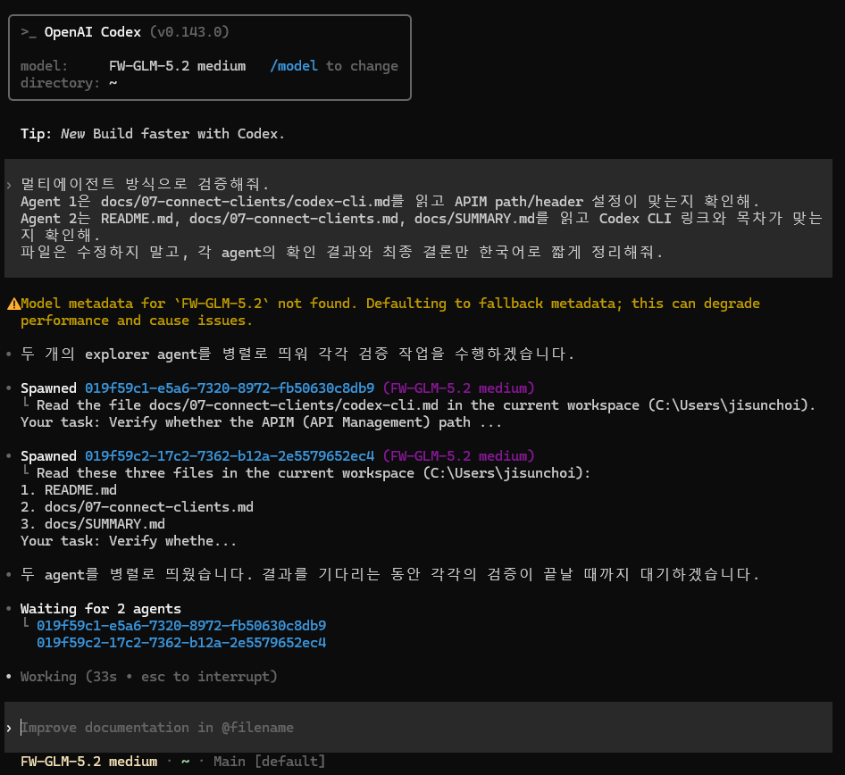
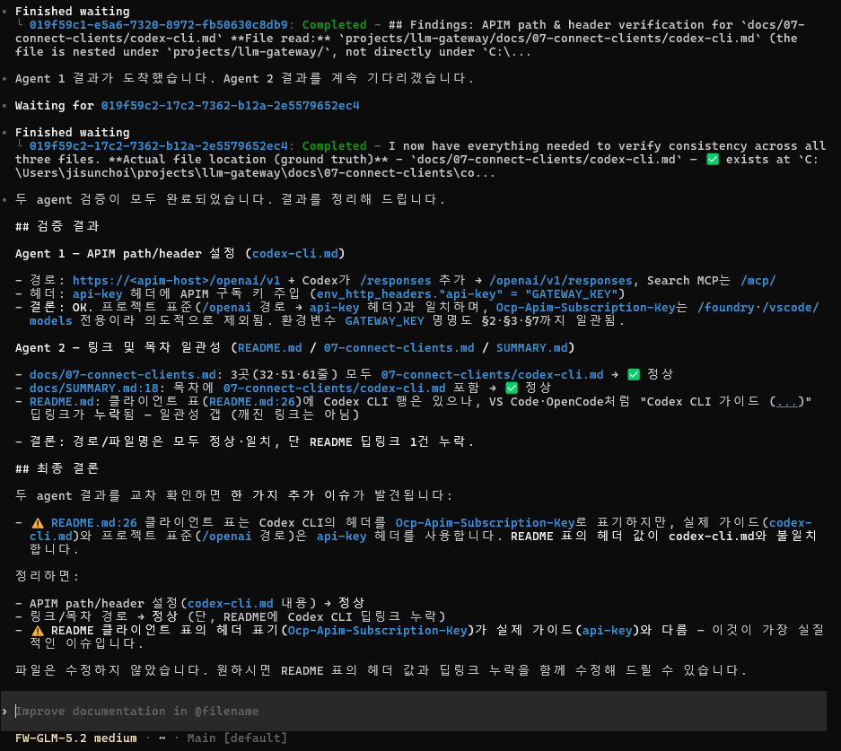
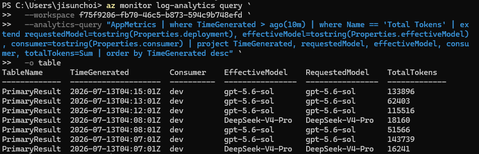

# Codex CLI

OpenAI Codex CLI를 custom model provider로 설정해 APIM 게이트웨이를 통과하도록 구성합니다. Codex CLI는 **Responses API 전용**(`wire_api = "responses"`)이며, 항상 `/openai/v1/responses`를 호출합니다. 최종 effective model이 `native_responses_models`에 있으면 APIM이 Foundry Responses API로 직접 전달하고, 목록에 없으면 APIM이 Codex proxy로 전달해 모델별 payload를 정규화합니다.


`native_responses_models`에 있는 모델(기본값: `gpt-5.6-sol`)은 Foundry Responses API로 직접 전달됩니다. 목록에 없는 모델 요청에서는 Codex proxy가 불안정한 server-hosted tool을 제거하므로, 웹 검색은 이 가이드의 Search MCP를 사용합니다.



Codex proxy와 Search MCP는 모두 APIM 뒤에 있으며 동일한 APIM subscription key를 사용합니다. APIM 이후의 sidecar와 Foundry 연결은 관리 ID(Managed Identity)와 내부 hop 인증을 사용합니다.


## 1. 선택 기준


**이 경로가 맞는 경우**

* OpenAI Codex CLI를 `gpt-5.6-sol`, `FW-GLM-5.2`, `DeepSeek-V4-Pro`, `grok-4.3` 중 하나로 사용한다.
* `codex` 명령을 실행하고 `~/.codex/config.toml`을 편집할 수 있다.
* Responses API 기반 에이전트 워크플로가 필요하다.
* OSS 모델에서 bounded web search를 사용하고 싶다.


## 2. 준비값

| 값                     | 예시                        |
| --------------------- | ------------------------- |
| APIM host             | `https://<apim-host>`     |
| APIM subscription key | `<APIM subscription key>` |
| Responses base URL    | `/openai/v1`              |
| Search MCP URL        | `/mcp/`                   |
| 인증 헤더                 | `api-key`                 |

APIM subscription key는 환경 변수로 둡니다.

```bash
export GATEWAY_KEY="<APIM subscription key>"
```


APIM subscription key를 `config.toml`, dotfiles, Git 저장소에 평문으로 커밋하지 마세요. 아래 `env_http_headers`는 **환경 변수 이름**만 담고 실제 키는 환경 변수로 주입합니다.


## 3. 설정 파일

Codex global config는 `~/.codex/config.toml`에 둡니다.

```toml
model = "gpt-5.6-sol"
model_provider = "aigateway"

[model_providers.aigateway]
name = "AI Gateway (Responses)"
base_url = "https://<apim-host>/openai/v1"
wire_api = "responses"

[model_providers.aigateway.env_http_headers]
"api-key" = "GATEWAY_KEY"

[mcp_servers.web_search]
url = "https://<apim-host>/mcp/"
required = true

[mcp_servers.web_search.env_http_headers]
"api-key" = "GATEWAY_KEY"
```


`wire_api`는 `"responses"`가 유일한 값입니다. `http_headers`는 리터럴 값이고 `env_http_headers`는 환경 변수 이름 매핑이므로, 환경 변수로 키를 전달할 때는 위와 같이 `env_http_headers`를 사용합니다.


## 4. 동작 방식

| 항목       | 값 |
| -------- | --- |
| base URL | `/openai/v1` |
| 요청 경로    | Codex가 `base_url` + `/responses` 호출 → APIM → `native_responses_models` 확인 → Foundry 직접 전달 또는 Codex proxy → AIServices project |
| APIM 인증  | `api-key` 헤더 |
| backend 인증 | APIM/sidecar 관리 ID(Entra ID) → AIServices 계정 |
| 라우팅      | 요청 body `model` 필드로 backend deployment 선택 |
| 웹 검색     | OSS 모델은 Codex client MCP → APIM `/mcp/` → Search MCP |

## 5. 모델별 지원 매트릭스

| 모델 | Codex 지원 | 처리 |
|---|---|---|
| `gpt-5.6-sol` | ✅ 권장 | 기본 검증 native 모델 — APIM이 Foundry Responses API로 직접 전달 |
| `FW-GLM-5.2` | ✅ 지원 | 추론 형식 보강, server-hosted tool 제거 |
| `DeepSeek-V4-Pro` | ✅ 지원 | 지원하지 않는 추론 강도와 server-hosted tool 제거 |
| `grok-4.3` | ✅ 지원 | 지원하지 않는 추론 강도와 server-hosted tool 제거 |

## 6. OSS hosted tool과 Search MCP

OSS 모델 요청에서는 Foundry가 직접 실행하는 server-hosted tool을 제거합니다.

| 분류 | 제거되는 server-hosted tool type |
|---|---|
| Web search | `web_search`, `web_search_2025_08_26`, `web_search_preview`, `web_search_preview_2025_03_11` |
| 기타 hosted tool | `code_interpreter`, `file_search`, `image_generation`, server-executed `mcp`, `computer`, `computer_use_preview`, `tool_search`, `shell`, `programmatic_tool_calling` |

이 처리는 **Codex client MCP를 끄지 않습니다.** `mcp_servers.*`에서 받은 Codex namespace tool은 프록시가 일반 function call로 변환하고, 응답과 대화 history에서 namespace를 복원하므로 Codex의 MCP dispatch가 계속 동작합니다.

Search MCP 호출 한 번은 다음 범위로 제한됩니다.

1. Codex의 MCP 호출 1회
2. APIM `/mcp/` 경유
3. `SEARCH_MODEL`에 대한 non-streaming Responses 요청 1회
4. hosted `web_search` 한 개 사용
5. `max_tool_calls=1`, `reasoning.effort="low"`
6. 답변과 중복 제거된 source URL 반환

추가 검색이 필요하면 Codex가 다음 MCP 호출을 명시적으로 다시 보냅니다. Foundry 오류나 timeout은 MCP tool error로 반환되며 OSS 모델의 response stream에 섞이지 않습니다. Search MCP에는 자체 retry나 fallback provider가 없습니다.

`web_search` MCP tool은 `readOnlyHint=true`로 게시되므로 기본 MCP 승인 모드의 비대화형 `codex exec`에서도 별도 승인 프롬프트 없이 사용할 수 있습니다.

### 검색 모델 변경

Search MCP의 검색 모델은 Container App의 `SEARCH_MODEL` 환경 변수로 선택합니다. hosted `web_search`를 지원하는 Foundry deployment 이름을 사용해야 합니다.

```powershell
az containerapp update `
  --resource-group <resource-group> `
  --name <search-mcp-container-app> `
  --set-env-vars SEARCH_MODEL=<foundry-deployment-name>
```

현재 Terraform 배포값은 `gpt-5.6-sol`로 고정되어 있으므로 위 명령은 임시 변경입니다. 다음 Terraform 적용에도 유지하려면 `infra/modules/control_plane/main.tf`의 `SEARCH_MODEL` 값과 관련 테스트를 함께 변경합니다.

## 7. 검증

단순 `pong` 테스트보다, Codex의 멀티에이전트 동작과 서브에이전트 호출을 각각 확인하는 시나리오를 권장합니다.

```bash
codex -m FW-GLM-5.2
```

Codex TUI에서 아래 프롬프트를 입력합니다.

```
멀티에이전트 방식으로 검증해줘.
Agent 1은 docs/07-connect-clients/codex-cli.md를 읽고 APIM path/header 설정이 맞는지 확인해.
Agent 2는 README.md, docs/07-connect-clients.md, docs/SUMMARY.md를 읽고 Codex CLI 링크와 목차가 맞는지 확인해.
파일은 수정하지 말고, 각 agent의 확인 결과와 최종 결론만 한국어로 짧게 정리해줘.
```

| 멀티에이전트 검증 | 서브에이전트 검증 |
| ---------------- | ---------------- |
|  |  |

OSS 모델의 Search MCP 호출은 다음처럼 별도로 확인합니다.

```bash
codex exec -m FW-GLM-5.2 "Use the web_search MCP once and report the answer with source URLs."
```

APIM을 실제로 거쳤는지는 Application Insights에 연결된 Log Analytics workspace의 `AppRequests` 테이블에서 확인합니다. 먼저 workspace customer ID를 조회한 뒤 Responses 요청을 검색합니다.

```bash
WORKSPACE_ID=$(az monitor log-analytics workspace show \
  --resource-group <rg> \
  --workspace-name <log-analytics-workspace-name> \
  --query customerId \
  -o tsv)

az monitor log-analytics query \
  --workspace "$WORKSPACE_ID" \
  --analytics-query "AppRequests | where TimeGenerated > ago(10m) | where Name contains 'responses' | project TimeGenerated, Name, ResultCode | order by TimeGenerated desc" \
  -o table
```

호출한 모델은 `AppMetrics`의 `deployment` 차원에서, budget downgrade 등을 거쳐 실제 처리된 모델은 `effectiveModel` 차원에서 확인합니다.

```bash
az monitor log-analytics query \
  --workspace "$WORKSPACE_ID" \
  --analytics-query "AppMetrics | where TimeGenerated > ago(10m) | where Name == 'Total Tokens' | extend requestedModel=tostring(Properties.deployment), effectiveModel=tostring(Properties.effectiveModel), consumer=tostring(Properties.consumer) | project TimeGenerated, requestedModel, effectiveModel, consumer, totalTokens=Sum | order by TimeGenerated desc" \
  -o table
```

`AppMetrics` token metric은 분 단위로 집계되므로 개별 `AppRequests` 행과 1:1로 연결되지는 않습니다.

<figure><figcaption><p>Application Insights 연결 Log Analytics</p></figcaption></figure>

오류가 발생하면 아래를 확인합니다.

* `base_url`이 `/openai/v1`로 끝나는지
* `GATEWAY_KEY` 환경 변수가 올바른 APIM subscription key인지
* `env_http_headers`로 `api-key`를 전달하는지
* 선택한 모델이 consumer allowed models에 포함되어 있는지
* Search MCP URL이 `/mcp/`로 끝나는지

| HTTP 상태 | 의미 |
|---|---|
| 401 | 인증 실패 |
| 403 | 구독 키 무효 또는 모델 미허용 |
| 404 | Responses 또는 Search MCP 경로 미배포 |
| 429 | token rate limit 또는 quota 초과 |

## 8. 참고 링크

* [Codex CLI — Config reference](https://developers.openai.com/codex/config-reference)
* [Foundry Models sold by Azure — GPT-5.6](https://learn.microsoft.com/azure/foundry/foundry-models/concepts/models-sold-directly-by-azure#gpt-56)
* [Responses API supported models](https://learn.microsoft.com/azure/foundry/openai/how-to/responses#supported-models)
* [Responses API web search](https://learn.microsoft.com/azure/foundry/openai/how-to/web-search)
* [Authenticate with managed identity](https://learn.microsoft.com/azure/api-management/api-management-authenticate-authorize-ai-apis#authenticate-with-managed-identity)
* [Azure API Management — Subscriptions](https://learn.microsoft.com/en-us/azure/api-management/api-management-subscriptions)
* [Azure CLI — Log Analytics query](https://learn.microsoft.com/cli/azure/monitor/log-analytics#az-monitor-log-analytics-query)
* [Azure Monitor — AppRequests table](https://learn.microsoft.com/azure/azure-monitor/reference/tables/apprequests)
* [Azure API Management — LLM token metric](https://learn.microsoft.com/azure/api-management/llm-emit-token-metric-policy)
