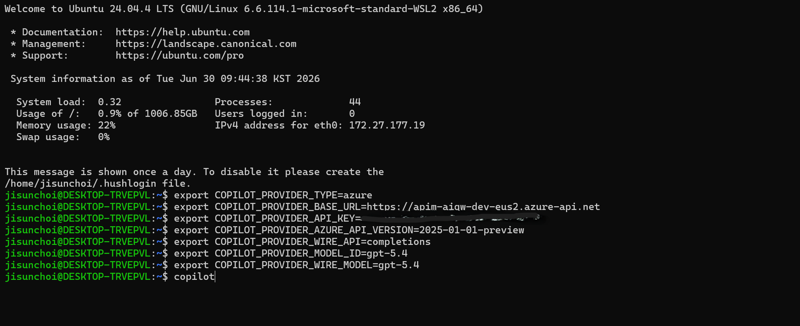
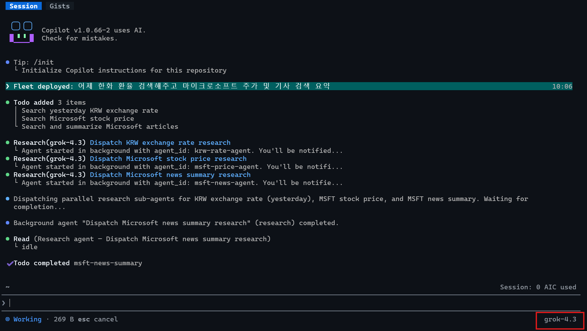

# GitHub Copilot CLI

GitHub Copilot CLI를 Azure provider 모드로 설정해 APIM 게이트웨이를 통과하도록 구성합니다. Copilot CLI는 Azure OpenAI 경로를 직접 조립하므로 base URL에는 **APIM host만** 넣습니다.

## 1. 선택 기준


**이 경로가 맞는 경우**

- GitHub Copilot CLI를 사용한다.
- `gh` CLI에서 `gh copilot` 명령을 실행할 수 있다.
- CLI의 Azure provider 환경 변수를 설정할 수 있다.
- 기본 모델을 하나 정해 CLI 세션에서 사용한다.


## 2. 준비값

| 값 | 예시 |
|---|---|
| APIM host | `https://<apim-host>` |
| APIM subscription key | `<APIM subscription key>` |
| API version | `2025-01-01-preview` |
| APIM 경로 | `/openai` |

`gh`가 없다면 먼저 설치하고 `gh copilot -- --help`가 실행되는지 확인합니다. `COPILOT_PROVIDER_BASE_URL`을 설정하는 BYOK 모드에서는 GitHub 인증 없이도 custom provider 호출을 시작할 수 있습니다.

## 3. 환경 변수 설정

<figure><figcaption>Copilot CLI 실행 전 `COPILOT_PROVIDER_*` 환경 변수 설정</figcaption></figure>

```bash
export COPILOT_PROVIDER_TYPE=azure
export COPILOT_PROVIDER_BASE_URL=https://<apim-host>
export COPILOT_PROVIDER_API_KEY="<APIM subscription key>"
export COPILOT_PROVIDER_AZURE_API_VERSION=2025-01-01-preview
export COPILOT_PROVIDER_WIRE_API=completions
export COPILOT_PROVIDER_MODEL_ID=gpt-5.4
export COPILOT_PROVIDER_WIRE_MODEL=gpt-5.4
```


`COPILOT_PROVIDER_BASE_URL`에 `/openai`를 붙이지 마세요. CLI가 내부적으로 `/openai/deployments/<model>/chat/completions` 경로를 구성합니다.



APIM 미경유로 Foundry 엔드포인트를 직접 테스트할 때는 `COPILOT_PROVIDER_TYPE=openai`, base URL `https://<리소스이름>.services.ai.azure.com/openai/v1`로 두고, API key 대신 Entra ID bearer token을 쓸 수 있습니다. bearer token은 API key보다 우선 적용되며 만료가 짧아 새 터미널마다 재발급해야 합니다. 두 값을 동시에 설정하지 마세요(`unset COPILOT_PROVIDER_API_KEY`).

```bash
export COPILOT_PROVIDER_BEARER_TOKEN=$(az account get-access-token \
  --resource https://cognitiveservices.azure.com --query accessToken -o tsv)
export COPILOT_PROVIDER_TYPE=openai
export COPILOT_PROVIDER_BASE_URL=https://<리소스이름>.services.ai.azure.com/openai/v1
export COPILOT_MODEL=<배포이름>
```


## 4. 동작 방식

| 항목 | 값 |
|---|---|
| base URL | APIM host만 입력 |
| 요청 경로 | CLI가 `/openai/deployments/<model>/chat/completions` 구성 |
| APIM 인증 | `/openai` 경로에서 `api-key` 헤더 사용 |
| APIM 처리 | URL의 deployment 이름을 body `model`에 주입 |

Copilot CLI가 보내는 API key는 APIM subscription key입니다. `/openai` 경로는 CLI 호환성을 위해 `api-key` 헤더를 APIM subscription key carrier로 사용합니다.

## 5. 모델 변경

다른 모델을 사용하려면 두 값을 함께 바꿉니다.

```bash
export COPILOT_PROVIDER_MODEL_ID=gpt-5.4-mini
export COPILOT_PROVIDER_WIRE_MODEL=gpt-5.4-mini
```

Admin UI에서 해당 consumer의 allowed models에 선택한 모델이 포함되어 있어야 합니다.


BYOK 모델은 GitHub 호스팅 카탈로그에 등록되지 않으므로 `/model` 목록에 안 보일 수 있습니다. `COPILOT_MODEL=<배포이름>`(또는 실행 시 `--model <배포이름>`)으로 직접 지정하세요. 호스팅 모델은 세션 중 `/model`로 전환하지만 BYOK는 환경 변수로 지정하는 것이 명확합니다.


## 6. 검증

<figure><figcaption>Copilot CLI 실행 결과 — 게이트웨이 경유 응답 확인</figcaption></figure>

오류가 발생하면 아래를 확인합니다.

- `COPILOT_PROVIDER_BASE_URL`에 `/openai`가 포함되어 있지 않은지
- `COPILOT_PROVIDER_API_KEY`가 올바른 APIM subscription key인지
- `COPILOT_PROVIDER_MODEL_ID`와 `COPILOT_PROVIDER_WIRE_MODEL`이 같은 모델인지
- 해당 모델이 consumer allowed models에 포함되어 있는지
- `gh copilot -- --help`가 실행되는지

## 7. 참고 링크

- [GitHub Copilot CLI](https://docs.github.com/en/copilot/concepts/agents/about-copilot-cli)
- [Azure API Management — Subscriptions](https://learn.microsoft.com/en-us/azure/api-management/api-management-subscriptions)
