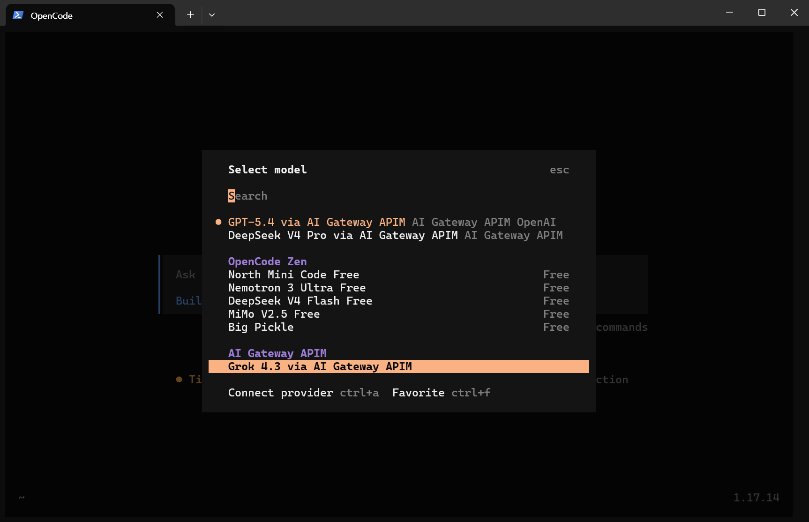
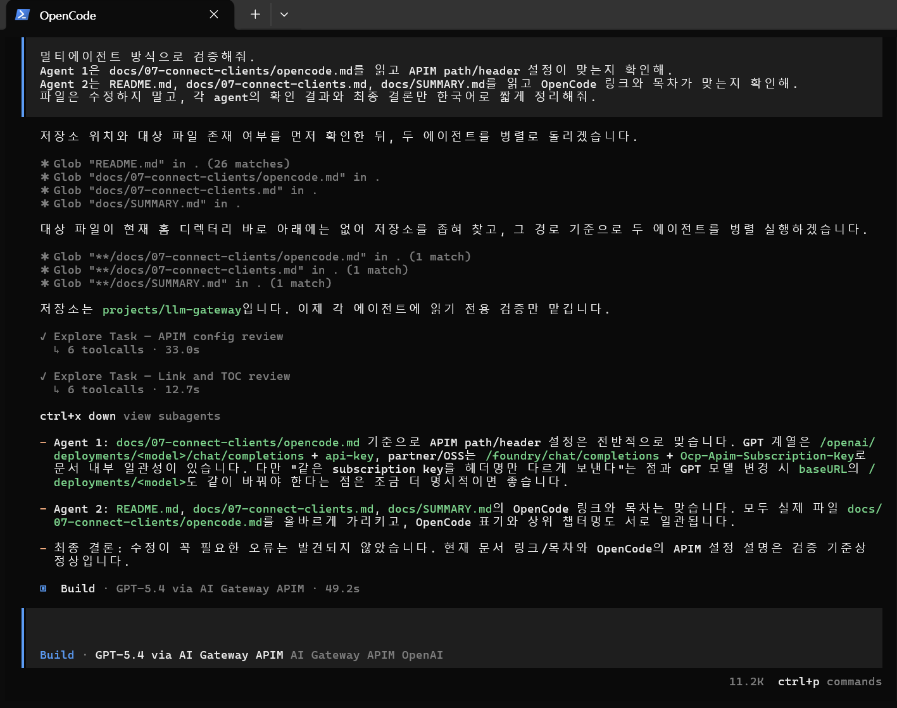
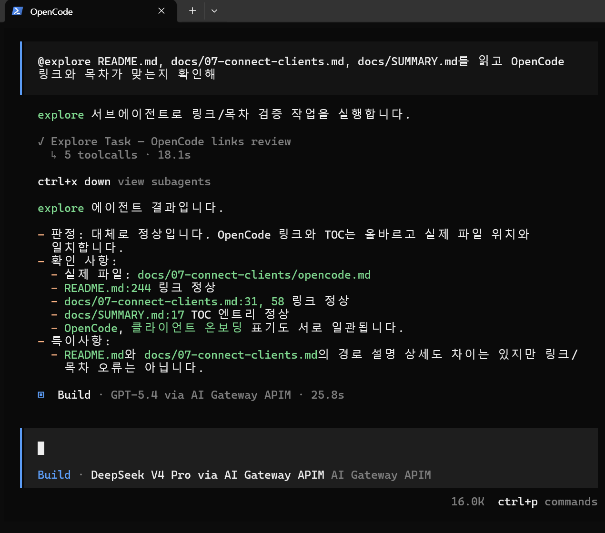

# OpenCode

OpenCode에서 APIM 게이트웨이를 통해 `gpt-5.6-sol`과 partner/OSS 모델(`FW-GLM-5.2`, `DeepSeek-V4-Pro`, `grok-4.3`)을 사용하도록 설정합니다. GPT-5.6은 OpenCode 내장 OpenAI provider로 Responses API를 사용하고, 나머지 모델은 OpenAI-compatible provider로 Chat Completions를 사용합니다.

## 1. 선택 기준


**이 경로가 맞는 경우**

* OpenCode에서 `opencode.json` provider 설정을 사용할 수 있다.
* APIM subscription key를 환경 변수나 별도 파일로 관리할 수 있다.
* GPT-5.6은 Responses API로, partner/OSS 모델은 Chat Completions로 호출한다.


## 2. 준비값

| 값                     | 예시                                    |
| --------------------- | ------------------------------------- |
| APIM host             | `https://<apim-host>`                 |
| APIM subscription key | `<APIM subscription key>`             |
| APIM base URL         | `https://<apim-host>/openai/v1`       |

APIM subscription key는 환경 변수로 둘 수 있습니다.

```bash
export AI_GATEWAY_API_KEY="<APIM subscription key>"
```


APIM subscription key를 `opencode.json`, dotfiles, Git 저장소에 평문으로 커밋하지 마세요. 아래 예시는 OpenCode의 `{env:...}` 치환을 사용합니다. 별도 파일을 쓰는 경우 `{file:/path/to/key}`로 바꿀 수 있습니다.


## 3. 설정 파일

OpenCode global config는 Linux 기준 `~/.config/opencode/opencode.json`에 둡니다.

```json
{
  "$schema": "https://opencode.ai/config.json",
  "model": "openai/gpt-5.6-sol",
  "small_model": "aigateway/DeepSeek-V4-Pro",
  "provider": {
    "openai": {
      "name": "AI Gateway APIM OpenAI Responses",
      "options": {
        "baseURL": "https://<apim-host>/openai/v1",
        "apiKey": "{env:AI_GATEWAY_API_KEY}",
        "headers": {
          "api-key": "{env:AI_GATEWAY_API_KEY}"
        }
      },
      "models": {
        "gpt-5.6-sol": {
          "name": "GPT-5.6 Sol via APIM Responses",
          "tool_call": true,
          "options": {
            "systemMessageMode": "system",
            "reasoningEffort": "high",
            "reasoningSummary": "auto",
            "textVerbosity": "low",
            "include": ["reasoning.encrypted_content"]
          }
        }
      }
    },
    "aigateway": {
      "npm": "@ai-sdk/openai-compatible",
      "name": "AI Gateway APIM",
      "options": {
        "baseURL": "https://<apim-host>/openai/v1",
        "headers": {
          "api-key": "{env:AI_GATEWAY_API_KEY}"
        }
      },
      "models": {
        "FW-GLM-5.2": {
          "name": "GLM 5.2 via APIM",
          "tool_call": true
        },
        "DeepSeek-V4-Pro": {
          "name": "DeepSeek V4 Pro via APIM",
          "tool_call": true
        },
        "grok-4.3": {
          "name": "Grok 4.3 via APIM",
          "tool_call": true
        }
      }
    }
  }
}
```


OpenCode 내장 `openai` provider는 GPT-5.6 요청을 `/responses`로 보내고, `@ai-sdk/openai-compatible` provider는 partner/OSS 요청을 `/chat/completions`로 보냅니다. 두 provider 모두 같은 `/openai/v1` base URL과 `api-key` 헤더를 사용합니다.


## 4. 동작 방식

| 항목                | GPT-5.6                              | partner/OSS 모델 |
| ----------------- | ------------------------------------ | --------------- |
| OpenCode model ID | `openai/gpt-5.6-sol`                 | `aigateway/FW-GLM-5.2`, `aigateway/DeepSeek-V4-Pro`, `aigateway/grok-4.3` |
| APIM base URL     | `/openai/v1`                         | `/openai/v1` |
| 실제 요청 경로          | `/openai/v1/responses`               | `/openai/v1/chat/completions` |
| APIM 인증           | `api-key`                            | `api-key` |
| API 형식             | Responses                            | Chat Completions |

GPT-5.6의 `reasoningEffort`, `reasoningSummary`, `textVerbosity`, `include` 값은 Responses 요청 옵션입니다. APIM policy는 OpenCode가 보낸 `/responses` 요청의 `input[]` 메시지에 누락된 `type: "message"`를 보강해 Azure Responses 형식과 호환되도록 처리합니다.

## 5. Azure provider와 Azure Cognitive Services provider

| OpenCode provider        | 기본 endpoint 전제                                          | 환경 변수                                                                        | APIM 경유 권장  |
| ------------------------ | ------------------------------------------------------- | ---------------------------------------------------------------------------- | ----------- |
| Azure                    | `https://<resource>.openai.azure.com/openai/...`        | `AZURE_RESOURCE_NAME`, `AZURE_API_KEY`                                       | 기본 권장 아님    |
| Azure Cognitive Services | `https://<resource>.cognitiveservices.azure.com/...` 계열 | `AZURE_COGNITIVE_SERVICES_RESOURCE_NAME`, `AZURE_COGNITIVE_SERVICES_API_KEY` | 기본 권장 아님    |
| custom OpenAI-compatible | 사용자가 지정한 `baseURL`                                      | 사용자 정의                                                                       | APIM 경유 기본값 |

OpenCode에서 **Azure Cognitive Services**가 보이는 것은 정상입니다. 다만 APIM gateway는 원본 Azure resource endpoint가 아닙니다. APIM 경유 시 GPT-5.6은 위의 내장 OpenAI provider를, partner/OSS 모델은 custom OpenAI-compatible provider를 사용합니다.

## 6. 모델 변경

처음 실행할 때 `--model`로 지정할 수 있습니다.

```bash
opencode --model openai/gpt-5.6-sol
```

OpenCode TUI 안에서는 `/model` 명령으로도 전환할 수 있습니다. 모델 목록에서 `openai/gpt-5.6-sol`, `aigateway/FW-GLM-5.2`, `aigateway/DeepSeek-V4-Pro`, `aigateway/grok-4.3` 중 하나를 선택합니다.

<figure><figcaption><p>OpenCode `/model` 모델 선택 — APIM 경유 provider 확인</p></figcaption></figure>

CLI에서 바로 partner/OSS 모델로 시작할 수도 있습니다.

```bash
opencode --model aigateway/DeepSeek-V4-Pro
opencode --model aigateway/FW-GLM-5.2
opencode --model aigateway/grok-4.3
```

Admin UI에서 해당 consumer의 allowed models에 선택한 모델이 포함되어 있어야 합니다.

## 7. 검증

단순 `pong` 테스트보다, OpenCode의 멀티에이전트 동작과 서브에이전트 호출을 각각 확인하는 시나리오를 권장합니다.

```bash
opencode --model openai/gpt-5.6-sol
```

OpenCode TUI에서 아래 프롬프트를 입력합니다.

```
멀티에이전트 방식으로 검증해줘.
Agent 1은 docs/07-connect-clients/opencode.md를 읽고 APIM path/header 설정이 맞는지 확인해.
Agent 2는 README.md, docs/07-connect-clients.md, docs/SUMMARY.md를 읽고 OpenCode 링크와 목차가 맞는지 확인해.
파일은 수정하지 말고, 각 agent의 확인 결과와 최종 결론만 한국어로 짧게 정리해줘.
```

| 멀티에이전트 검증                                                                                     | 서브에이전트 검증                                                                                   |
| --------------------------------------------------------------------------------------------- | ------------------------------------------------------------------------------------------- |
|  |  |

## 8. 참고 링크

* [OpenCode — Providers](https://opencode.ai/docs/providers/)
* [OpenCode — Config](https://opencode.ai/docs/config/)
* [AI SDK — OpenAI Compatible Providers](https://ai-sdk.dev/providers/openai-compatible-providers)
* [Azure OpenAI Responses API](https://learn.microsoft.com/azure/ai-foundry/openai/how-to/responses)
* [Azure API Management policies](https://learn.microsoft.com/azure/api-management/api-management-howto-policies)
* [Azure API Management — Subscriptions](https://learn.microsoft.com/en-us/azure/api-management/api-management-subscriptions)
