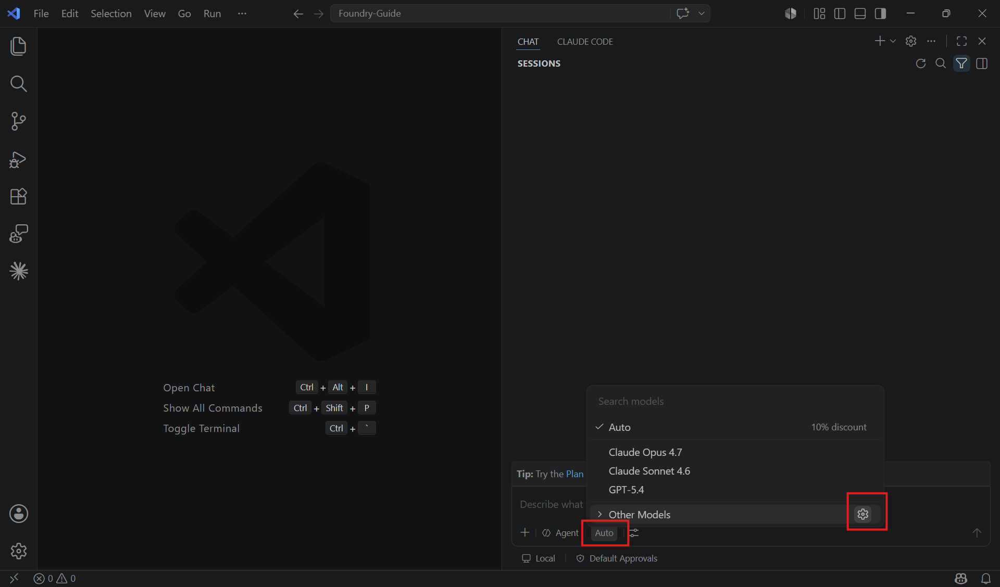
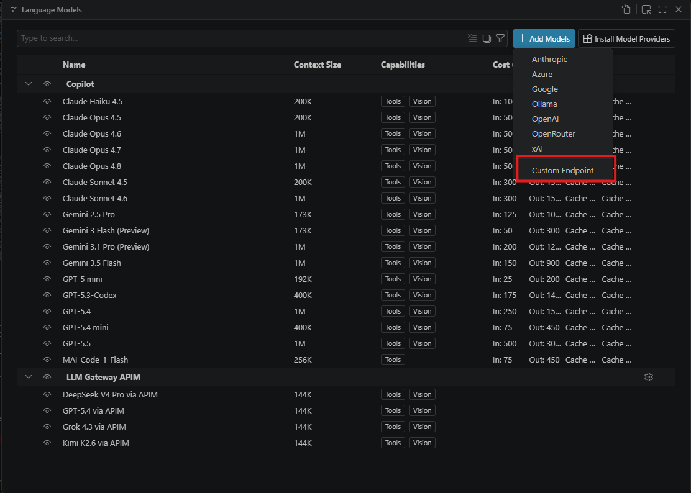
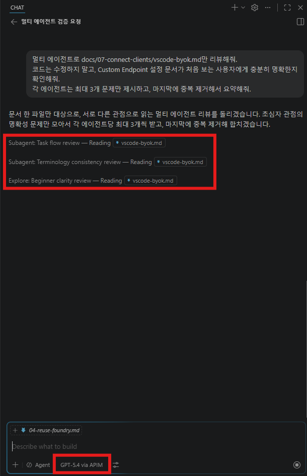
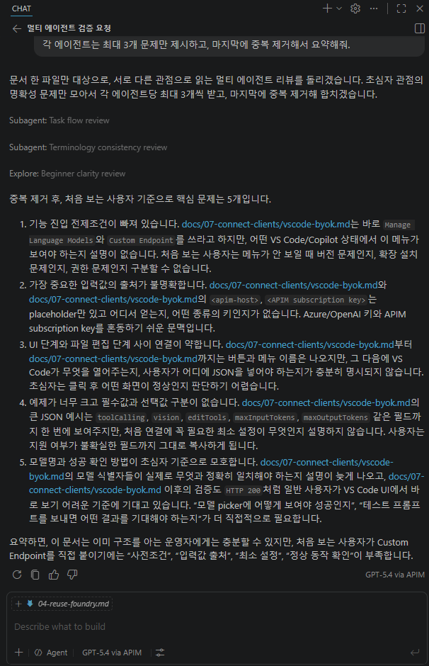

# VS Code BYOK

VS Code의 custom language model 설정에 APIM 게이트웨이를 등록합니다. VS Code는 `requestHeaders`로 `Ocp-Apim-Subscription-Key`를 보낼 수 있으므로 `/vscode/models` 경로를 사용합니다. 이 경로는 지원 모델 네 개(`gpt-5.6-sol`, `FW-GLM-5.2`, `DeepSeek-V4-Pro`, `grok-4.3`)를 같은 방식으로 사용합니다.

## 1. 선택 기준


**이 경로가 맞는 경우**

* VS Code에서 BYOK/custom model endpoint를 사용한다.
* 모델별 URL을 `chatLanguageModels.json`에 등록할 수 있다.
* APIM subscription key를 `Ocp-Apim-Subscription-Key` 헤더로 전달하고 싶다.


## 2. 준비값

| 값                     | 예시                        |
| --------------------- | ------------------------- |
| APIM host             | `https://<apim-host>`     |
| APIM subscription key | `<APIM subscription key>` |
| API version           | `2025-01-01-preview`      |
| APIM 경로               | `/vscode/models`          |

## 3. 설정 파일

### 3-1. Manage Models 열기

Copilot **Chat** 창을 열고 모델 선택기 옆 **톱니(⚙) 아이콘** 또는 명령 팔레트(`Ctrl+Shift+P`)에서 \*\*"Chat: Manage Language Models"\*\*를 실행합니다.

<figure><figcaption><p>모델 선택기 → 톱니(⚙) → Manage Models</p></figcaption></figure>

### 3-2. 공급자 Custom Endpoint 선택

**Add Models**에서 공급자로 **Custom Endpoint**를 선택합니다. APIM 게이트웨이를 경유하는 경우 Azure provider가 아니라 Custom Endpoint provider를 사용합니다.

<figure><figcaption><p>Add Models → 공급자 Custom Endpoint 선택</p></figcaption></figure>

### 3-3. chatLanguageModels.json

VS Code의 `chatLanguageModels.json`에 모델을 등록합니다. 저장하면 추가한 모델이 모델 선택기에 표시됩니다.

```json
[
  {
    "name": "LLM Gateway APIM",
    "vendor": "customendpoint",
    "apiType": "chat-completions",
    "models": [
      {
        "id": "gpt-5.6-sol",
        "name": "GPT-5.6 Sol via APIM",
        "url": "https://<apim-host>/vscode/models/deployments/gpt-5.6-sol/chat/completions?api-version=2025-01-01-preview",
        "apiType": "chat-completions",
        "toolCalling": true,
        "modelOptions": {
          "temperature": null
        },
        "vision": true,
        "editTools": [
          "find-replace",
          "multi-find-replace",
          "apply-patch",
          "code-rewrite"
        ],
        "maxInputTokens": 922000,
        "maxOutputTokens": 128000,
        "requestHeaders": {
          "Ocp-Apim-Subscription-Key": "<APIM subscription key>"
        }
      },
      {
        "id": "FW-GLM-5.2",
        "name": "GLM 5.2 via APIM",
        "url": "https://<apim-host>/vscode/models/deployments/FW-GLM-5.2/chat/completions?api-version=2025-01-01-preview",
        "apiType": "chat-completions",
        "toolCalling": true,
        "vision": true,
        "editTools": [
          "find-replace",
          "multi-find-replace",
          "apply-patch",
          "code-rewrite"
        ],
        "maxInputTokens": 128000,
        "maxOutputTokens": 16000,
        "requestHeaders": {
          "Ocp-Apim-Subscription-Key": "<APIM subscription key>"
        }
      },
      {
        "id": "DeepSeek-V4-Pro",
        "name": "DeepSeek V4 Pro via APIM",
        "url": "https://<apim-host>/vscode/models/deployments/DeepSeek-V4-Pro/chat/completions?api-version=2025-01-01-preview",
        "apiType": "chat-completions",
        "toolCalling": true,
        "vision": true,
        "editTools": [
          "find-replace",
          "multi-find-replace",
          "apply-patch",
          "code-rewrite"
        ],
        "maxInputTokens": 128000,
        "maxOutputTokens": 16000,
        "requestHeaders": {
          "Ocp-Apim-Subscription-Key": "<APIM subscription key>"
        }
      },
      {
        "id": "grok-4.3",
        "name": "Grok 4.3 via APIM",
        "url": "https://<apim-host>/vscode/models/deployments/grok-4.3/chat/completions?api-version=2025-01-01-preview",
        "apiType": "chat-completions",
        "toolCalling": true,
        "vision": true,
        "editTools": [
          "find-replace",
          "multi-find-replace",
          "apply-patch",
          "code-rewrite"
        ],
        "maxInputTokens": 128000,
        "maxOutputTokens": 16000,
        "requestHeaders": {
          "Ocp-Apim-Subscription-Key": "<APIM subscription key>"
        }
      }
    ]
  }
]
```


구독 키를 URL query string에 넣지 마세요. VS Code 설정에는 `requestHeaders`를 사용합니다.



`gpt-5.6-sol`은 `temperature: 0.1`을 허용하지 않고 서버 기본값만 지원합니다. VS Code 1.128+에서는 위 예시처럼 `modelOptions.temperature`를 `null`로 설정해 해당 파라미터를 생략하세요.


## 4. 동작 방식

| 항목      | 값                                                     |
| ------- | ----------------------------------------------------- |
| 요청 경로   | `/vscode/models/deployments/<model>/chat/completions` |
| 모델 위치   | URL의 deployment segment                               |
| APIM 인증 | `Ocp-Apim-Subscription-Key`                           |
| APIM 처리 | URL의 모델명을 body `model`에 주입 후 backend로 전달              |

## 5. 검증

VS Code에서 등록한 모델이 모델 목록에 보이는지 확인합니다. 간단한 프롬프트를 보내 HTTP 200 응답이 오면 연결이 완료된 것입니다.

이 경로의 tool calling은 gateway에서 path-route로 처리되며, `chatLanguageModels.json`의 `toolCalling` 값을 `true`로 둡니다. `gpt-5.6-sol`의 `maxInputTokens: 922000`, `maxOutputTokens: 128000` 값은 Microsoft Learn의 [GPT-5.6 capability table](https://learn.microsoft.com/azure/foundry/foundry-models/concepts/models-sold-directly-by-azure#gpt-56)를 기준으로 맞춥니다.

| Custom Endpoint 모델 선택                                                                                   | subagent 호출 확인                                                                                 |
| ------------------------------------------------------------------------------------------------------- | ---------------------------------------------------------------------------------------------- |
|  |  |

### BYOK utility model (VS Code 1.128+)

VS Code 1.128부터는 BYOK 모델을 주 agent 모델로 선택했을 때 제목 생성이나 commit message 생성 같은 내장 utility 흐름에 쓸 모델을 별도로 결정합니다. 기본값은 utility 모델을 사용하지 않는 것이므로 아래 오류가 발생할 수 있습니다.

```text
No utility model is configured for 'copilot-utility-small' while the selected main agent model is BYOK.
```

사용자 전역 `settings.json`에 아래 설정을 추가합니다. `mainAgent`는 현재 선택한 APIM BYOK 모델을 utility 작업에도 재사용합니다.

```json
{
  "chat.byokUtilityModelDefault": "mainAgent"
}
```

이 설정은 `chatLanguageModels.json`의 모델 등록을 대체하지 않습니다. 설정 후에도 오류가 보이면 **Developer: Reload Window**를 실행한 뒤 모델을 다시 선택합니다.


직접 Foundry 연결(APIM 미경유) 시에는 Azure provider를 사용할 수 있습니다. APIM 게이트웨이를 경유하는 운영 경로에서는 Custom Endpoint provider와 `/vscode/models` 경로를 사용해 토큰 한도·메트릭·로깅을 일관되게 적용하세요.


오류가 발생하면 아래를 확인합니다.

* `<apim-host>`에 `https://`가 포함되어 있는지
* URL 경로가 `/vscode/models`인지
* 구독 키가 `Ocp-Apim-Subscription-Key` 헤더로 들어갔는지
* 소비자 allowed models에 선택한 모델이 포함되어 있는지
* APIM이 public이 아니면 VPN/VNet 경로가 준비되어 있는지
* VS Code 1.128+에서 `chat.byokUtilityModelDefault`가 `mainAgent`인지

## 6. 참고 링크

* [VS Code — Language Model API](https://code.visualstudio.com/docs/copilot/language-models)
* [VS Code 1.128 — Configure sampling parameters for Custom Endpoint models](https://code.visualstudio.com/updates/v1_128#_configure-sampling-parameters-for-custom-endpoint-models)
* [VS Code 1.128 — Configure the default utility model for BYOK](https://code.visualstudio.com/updates/v1_128#_configure-the-default-utility-model-for-byok)
* [Azure API Management — Subscriptions](https://learn.microsoft.com/en-us/azure/api-management/api-management-subscriptions)
* [Responses API supported models](https://learn.microsoft.com/azure/foundry/openai/how-to/responses#supported-models)
