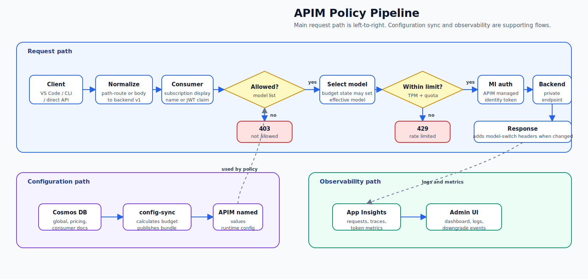

# 아키텍처 상세

이 장은 llm-gateway의 **구현 구조**를 설명합니다. 정책의 의미와 운영 판단 기준은 [거버넌스](02-governance.md)에서 다루고, 여기서는 APIM 정책, Terraform 모듈, 보안 경계, 설정 스키마가 어떻게 연결되는지에 집중합니다.

## APIM 정책 파이프라인

APIM은 모든 요청을 같은 순서로 처리합니다. 클라이언트별 엔드포인트는 다르지만, consumer 식별 이후의 거버넌스 흐름은 동일합니다.

<figure><figcaption><p>APIM 정책 파이프라인 — 동기 요청 처리와 설정·관측 평면의 연결</p></figcaption></figure>

### 클라이언트 엔드포인트

| APIM 경로 | 주 클라이언트 | 인증 헤더 | 요청 형식 |
|---|---|---|---|
| `/openai/v1/chat/completions` | GitHub Copilot CLI, OpenCode, 직접 API | `api-key` | body-route (`"model"` in body) |
| `/openai/v1/responses` | Codex CLI, OpenCode | `api-key` | Responses body-route; partner/OSS via Codex proxy |
| `/vscode/models` | VS Code BYOK | `Ocp-Apim-Subscription-Key` | path-route |
| `/mcp/` | Codex Search MCP | `api-key` | Streamable HTTP MCP |

VS Code의 path-route 요청만 APIM 정책에서 body-route로 정규화됩니다. 일반 Chat Completions 요청은 처음부터 body의 `"model"` 필드를 사용합니다. Responses 요청은 모델에 따라 Codex proxy sidecar가 응답·도구 payload를 정규화한 뒤 같은 `codexproj` project의 `/openai/v1/responses`를 호출합니다.

### 정책이 남기는 관측 정보

다운그레이드가 발생하면 응답과 로그 양쪽에 같은 의미의 값이 남습니다.

| 위치         | 필드                                                                                             |
| ---------- | ---------------------------------------------------------------------------------------------- |
| 응답 헤더      | `x-ai-gateway-requested-model`, `x-ai-gateway-effective-model`, `x-ai-gateway-downgrade-level` |
| AppTraces  | `consumer`, `requestedModel`, `effectiveModel`, `downgradeLevel`                               |
| AppMetrics | `consumer`, `deployment`, `effectiveModel`                                                     |


`AppRequests`의 URL은 항상 클라이언트가 요청한 path 기준입니다. 실제 처리 모델은 `effectiveModel` 차원이나 응답 헤더에서 확인하세요.


## Terraform 모듈 구조

인프라는 `infra/modules/` 아래 기능 단위로 분리되어 있습니다.

| 모듈              | 역할                                                                    |
| --------------- | --------------------------------------------------------------------- |
| `network`       | VNet, APIM/PE/ACA/jumpbox 서브넷, NSG, Private DNS                       |
| `identity`      | worker/Admin UI용 user-assigned identity                               |
| `keyvault`      | Key Vault + Private Endpoint                                          |
| `observability` | Log Analytics, Application Insights, Cost budget                      |
| `foundry`       | greenfield canonical AIServices account/project와 네 deployment, 또는 brownfield 계정 참조 |
| `apim`          | APIM 인스턴스, API surfaces, policy XML, diagnostics                      |
| `config_store`  | Cosmos DB 설정 저장소와 데이터 평면 RBAC                                         |
| `registry`      | ACR remote build 대상                                                   |
| `control_plane` | config-sync worker, Admin UI, Codex proxy Container Apps               |
| `jumpbox`       | VNet 내부 seed/진단용 VM과 Bastion                                          |

모듈 간 의존성은 아래처럼 흘러갑니다.

```
network ─┬─ private endpoints ─▶ foundry / cosmos / keyvault
         ├─▶ apim ─▶ backend RBAC + API policies
         └─▶ control_plane ─▶ worker + Admin UI + Codex proxy

config_store ─▶ worker ─▶ APIM named values
observability ─▶ APIM diagnostics + Admin UI dashboards
registry ─▶ worker/admin-ui/codexproxy images
```

### Greenfield와 Brownfield

| 항목               | Greenfield    | Brownfield                             |
| ---------------- | ------------- | -------------------------------------- |
| Foundry 계정       | Terraform이 생성 | 기존 계정을 data source로 읽음                 |
| 모델 deployment    | Terraform이 생성 | 생성하지 않음                                |
| Private Endpoint | Terraform이 생성 | 게이트웨이 VNet에서 기존 계정으로 새 PE 생성           |
| RBAC             | Terraform이 부여 | APIM identity에 기존 계정 접근 권한 부여          |
| 계정 속성            | Terraform이 관리 | 고객이 API key 인증·공용 접근 차단, Terraform은 검증 |

Brownfield 경로는 기존 모델을 건드리지 않고 게이트웨이 거버넌스 레이어만 추가하는 방식입니다. 자세한 절차는 [모델 백엔드 기존 계정 재사용](04-reuse-foundry.md)을 참고하세요.

## 보안 경계

게이트웨이의 보안 설계는 **클라이언트 인증**, **백엔드 인증**, **네트워크 격리**, **운영 평면 권한**을 분리합니다.

| 경계                         | 방식                                                | 핵심 포인트                   |
| -------------------------- | ------------------------------------------------- | ------------------------ |
| 클라이언트 → APIM               | APIM subscription key 또는 Entra ID JWT             | consumer 식별의 시작점         |
| APIM → 모델 backend          | APIM system-assigned managed identity + RBAC      | 모델 계정 key 사용 없음          |
| APIM → backend 네트워크        | Private Endpoint + Private DNS                    | backend public access 차단 |
| Admin UI / worker → Cosmos | user-assigned managed identity + Cosmos data RBAC | connection string 사용 없음  |
| 비밀 관리                      | Key Vault + RBAC                                  | 코드와 tfvars에 secret 저장 금지 |


Key Vault는 purge protection이 켜져 있습니다. `terraform destroy` 후에도 즉시 purge되지 않고 retention 기간이 끝난 뒤 삭제됩니다.


## Cosmos DB 설정 스키마

Cosmos DB의 `config` 컨테이너가 런타임 거버넌스의 원천입니다. config-sync worker가 이 문서를 읽어 APIM named values로 반영합니다. 반대로 Admin UI의 모델 picker는 Terraform이 `model_deployments`에서 생성한 `ALIAS_MODELS_JSON`을 BFF env로 주입해 구성됩니다.

| 문서                | 소유자               | 용도                                                       |
| ----------------- | ----------------- | -------------------------------------------------------- |
| `global`          | 운영자 / seed script | 전역 allowed models, 기본 token limit                        |
| `pricing`         | 운영자 / seed script | 모델별 prompt/completion 단가                                 |
| `consumer:<name>` | Admin UI          | consumer별 allowed models, tier, budget, downgrade ladder |

### `global`

```json
{
  "id": "global",
  "allowed_models": ["gpt-5.6-sol", "FW-GLM-5.2", "DeepSeek-V4-Pro", "grok-4.3"],
  "tokens_per_minute": 500000,
  "token_quota": 10000000,
  "token_quota_period": "Daily"
}
```

### `pricing`

```json
{
  "id": "pricing",
  "models": {
    "grok-4.3": { "prompt": 0.00125, "completion": 0.0025 },
    "DeepSeek-V4-Pro": { "prompt": 0.00174, "completion": 0.00348 }
  }
}
```

### `consumer:<name>`

```json
{
  "id": "consumer:vscode",
  "doc_type": "consumer_config",
  "consumer": "vscode",
  "allowed_models": ["gpt-5.6-sol", "DeepSeek-V4-Pro", "grok-4.3"],
  "tier": "large",
  "daily_budget_usd": 3,
  "downgrade_ladder": ["gpt-5.6-sol", "DeepSeek-V4-Pro", "grok-4.3"],
  "active_downgrade": {
    "level": 1,
    "usage_usd": 2.56,
    "pct": 0.85,
    "evaluated_at": "2026-06-26T02:00:33Z"
  }
}
```

`active_downgrade`는 Admin UI가 직접 쓰는 값이 아니라 config-sync worker가 계산해 갱신하는 상태입니다.

## 관련 참조

* [거버넌스](02-governance.md) — 정책 의미와 운영 판단 기준
* [운영](06-operate.md) — 설정 변경, 모니터링, 모델 전환 이벤트 확인
* [모델 백엔드 기존 계정 재사용](04-reuse-foundry.md) — Brownfield 계정 연결 방식
* [부록: 변수·출력·문제 해결](10-reference.md) — 변수, 출력, 문제 해결
