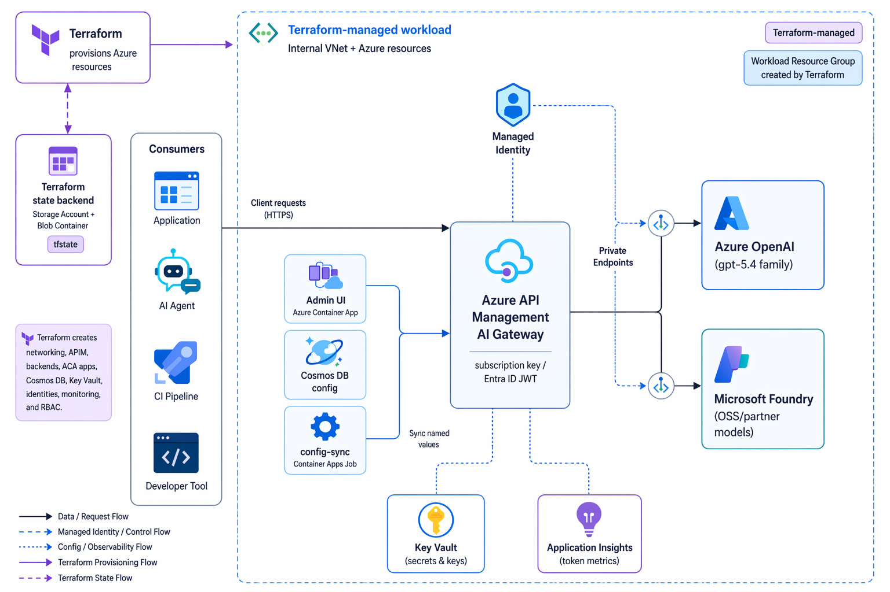

# Azure AI Gateway — 배포·운영 가이드

이 문서는 플랫폼 팀을 위한 **Azure AI Gateway** 배포·운영 가이드입니다. [Azure API Management](https://learn.microsoft.com/ko-kr/azure/api-management/api-management-key-concepts) 위에 [Azure OpenAI](https://learn.microsoft.com/ko-kr/azure/ai-services/openai/overview)와 [Azure AI Foundry](https://learn.microsoft.com/ko-kr/azure/ai-foundry/what-is-azure-ai-foundry) 모델을 단일 거버넌스 엔드포인트로 묶고, 소비자별 모델 권한·토큰 속도 제한·예산 기반 모델 전환·셀프서비스 관리 UI를 제공합니다.

---

## 대상 독자

| 역할 | 관련 챕터 |
|---|---|
| 인프라 엔지니어 (Terraform 운영) | 03 배포, 모델 백엔드 신규/기존 계정 경로, 06 운영 |
| 플랫폼/DevOps 엔지니어 | 02 거버넌스, 사전 준비, 03-04 배포, 06 운영 |
| 개발자 (클라이언트 온보딩) | 07 클라이언트 온보딩 |
| 아키텍트 | 01 개요, 08 아키텍처 상세, 09 향후 지원 계획 |

---

## 아키텍처 개요

클라이언트(VS Code, GitHub Copilot CLI, 직접 API 호출 등)가 공개 APIM 엔드포인트에 요청을 보내면, APIM 정책이 소비자를 식별하고 모델 허용 여부·속도 제한·예산 상태를 순차 검사한 뒤 Private Endpoint를 통해 백엔드 AIServices 계정으로 전달합니다. 백엔드는 Managed Identity 기반 RBAC으로만 접근하며 키 인증은 비활성화되어 있습니다.

---

## 문서 구조


{% column width="50%" %}

[01 개요 — 게이트웨이의 목적·동작 방식·핵심 개념 정의](01-overview.md)



[아키텍처 상세 — 정책 흐름, 모듈 구조, 보안 설계](08-architecture.md)



[02 거버넌스 — 소비자, 클라이언트 인증, 모델 권한, rate limit, budget 전환](02-governance.md)



[03 배포 — 모델 백엔드 결정, APIM 게이트웨이, Admin UI](03-deploy.md)



[모델 백엔드 기존 계정 재사용 — 기존 AIServices 계정을 data로 읽어 게이트웨이 연결](04-reuse-foundry.md)




{% column width="50%" %}

[06 운영 — 설정 변경, 모니터링, 비용 관리, 정리](06-operate.md)



[07 클라이언트 온보딩 — VS Code, GHCP CLI, 직접 API 호출 등 클라이언트별 연결 방법](07-connect-clients.md)



[09 향후 지원 계획 — Entra ID 인증, Claude Code, Codex/Responses API](09-future.md)



[10 부록 — 변수·출력·문제 해결](10-reference.md)





**읽는 순서 권장:** 처음 배포라면 01 → 02 → 03에서 모델 백엔드 경로를 결정한 뒤 각 배포 페이지의 호출 검증 절에서 확인하세요. 기존 환경에 연결하는 개발자는 07부터 시작해도 됩니다.

